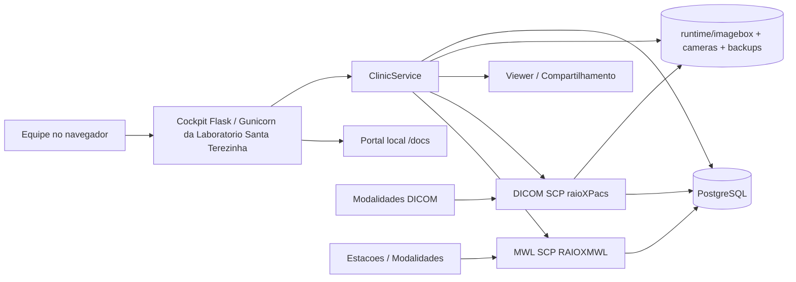
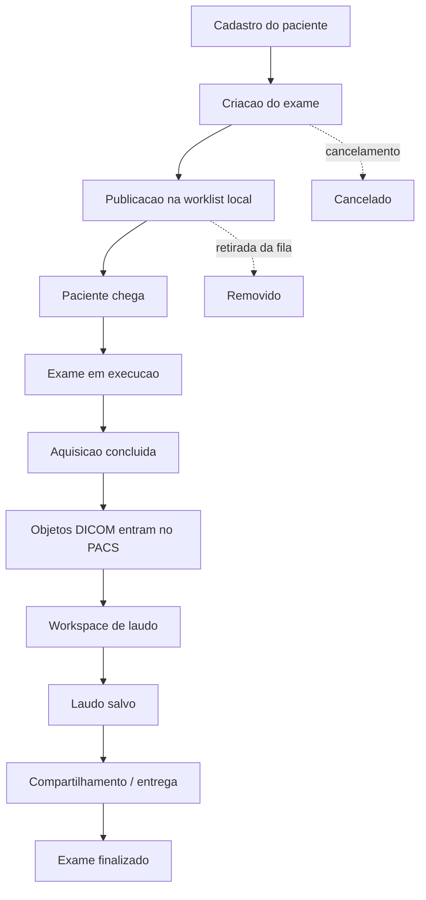
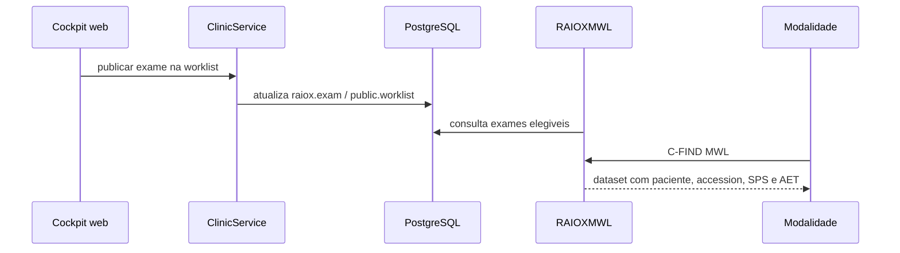
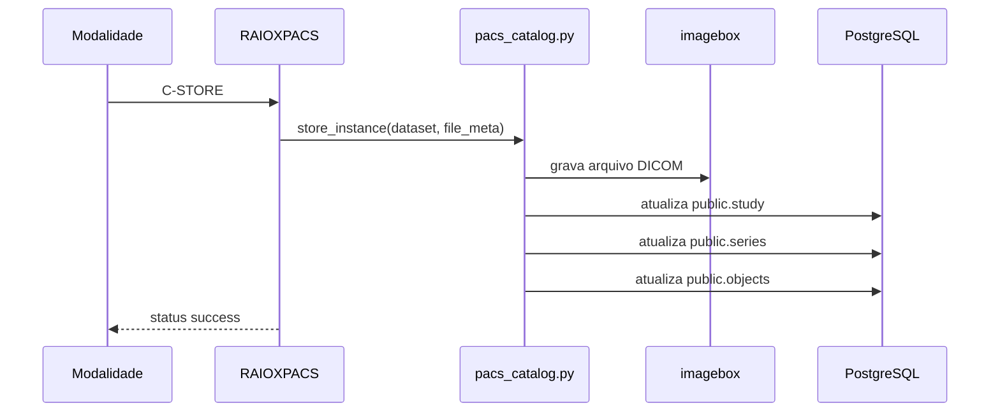
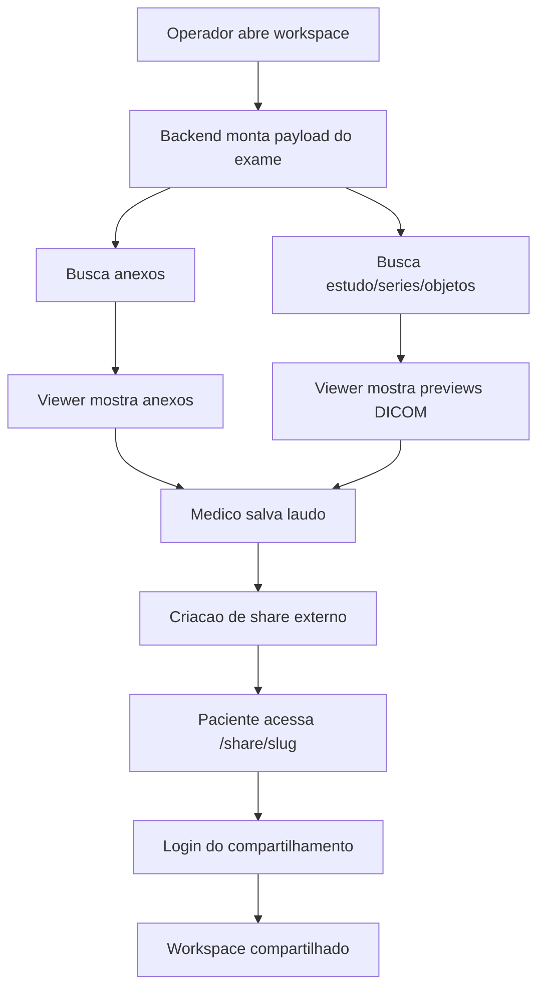
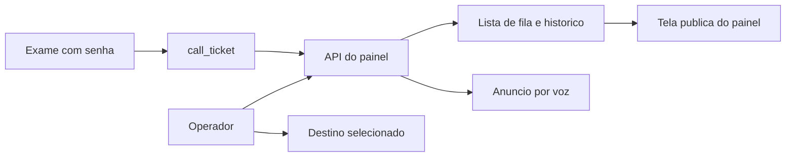
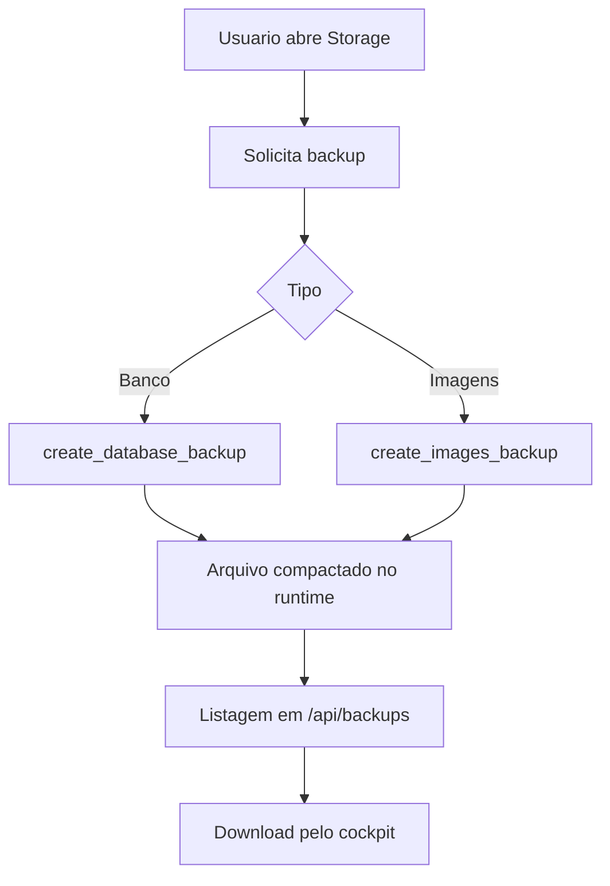
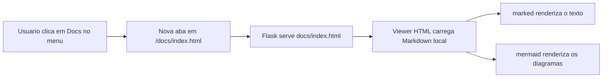
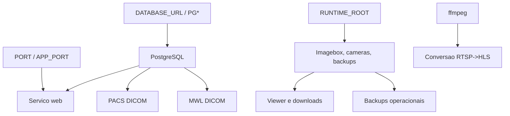

# Diagramas e Processos da Laboratorio Santa Terezinha

## 1. Como usar este arquivo

Abra este documento em:

- `documentacao.html?doc=DIAGRAMAS_E_PROCESSOS.md` para ler como Markdown;
- `diagramas.html` para navegar com renderizacao visual Mermaid.

## 2. Macroarquitetura do sistema



## 3. Fluxo do exame do cadastro ate a finalizacao



## 4. Publicacao e consumo da worklist



## 5. Entrada de um estudo DICOM no PACS



## 6. Fluxo do workspace, laudo e compartilhamento



## 7. Fluxo do painel de chamadas



## 8. Fluxo das cameras

```mermaid
flowchart TD
    A[Cadastro da camera] --> B{Modo}
    B -->|RTSP| C[ffmpeg gera HLS em runtime/cameras]
    B -->|HLS direto| D[Frontend consome URL pronta]
    C --> E[/camera-streams/.../live.m3u8]
    D --> F[Monitor de cameras]
    E --> F
    F --> G[Status: starting, streaming, ready, error ou disabled]
```

## 9. Fluxo de backup



## 10. Fluxo do portal `/docs`



## 11. Diagrama de dependencias operacionais



## 12. Leitura recomendada depois dos diagramas

- [Arquitetura](ARQUITETURA_SISTEMA.md)
- [Uso e Fluxos](USO_E_FLUXOS_FUNCIONAIS.md)
- [Operacao e Deploy](OPERACAO_E_DEPLOY.md)
- [API e Dados](API_E_DADOS.md)
