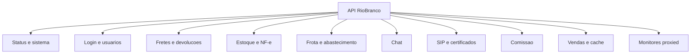
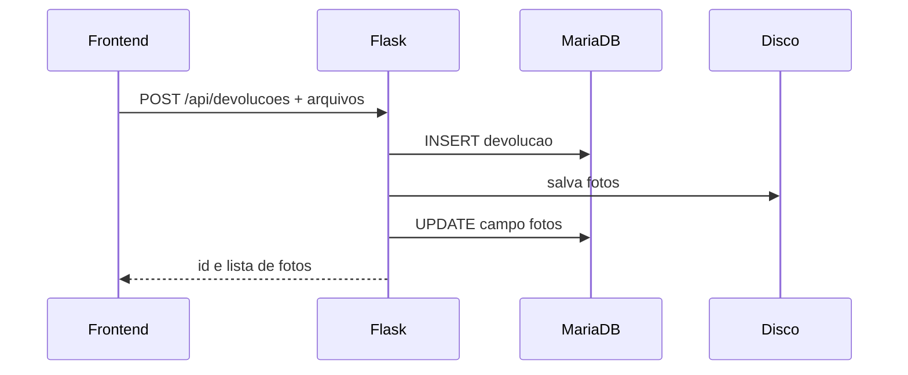
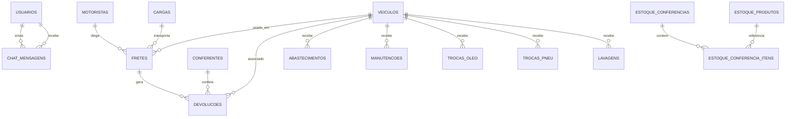

# API e Modelo de Dados do Sistema RioBranco

## 1. Objetivo

Este documento consolida:

- convencoes da API
- dominios funcionais e endpoints
- exemplos de payload
- modelo de dados principal
- observacoes de integracao e persistencia

## 2. Convencoes da API

### 2.1 Formato

- API HTTP JSON
- respostas de arquivo quando aplicavel, como PDF, SQL, certificados e scripts

### 2.2 Cache

Todas as rotas `/api/*` recebem cabecalhos `no-store/no-cache` no backend.

Atualizacao operacional importante:

- o mesmo tratamento agora tambem cobre `/`, `/RioBranco.html`, `/script.js` e `/style.css`
- isso reduz risco de o navegador manter frontend antigo logo apos deploy ou rebuild do container

### 2.3 Identificacao do usuario

O frontend envia cabecalhos como:

- `X-Usuario-Id`
- `X-Usuario-Nome`
- `X-Usuario-Login`
- `X-Usuario-Logado`

Eles sao usados para contexto operacional, chat, SIP e logs.

### 2.4 Erros

Padrao mais comum:

```json
{ "erro": "mensagem" }
```

## 3. Dominios da API



## 4. Autenticacao e sessao

### 4.1 `POST /api/login`

Funcao:

- autentica o usuario do sistema
- aceita hash moderno e fallback para senha legada em texto
- quando detecta senha legada, faz upgrade para hash
- tenta completar `sip_senha` quando possivel

Payload:

```json
{
  "login": "usuario",
  "senha": "senha-do-usuario"
}
```

Resposta:

```json
{
  "ok": true,
  "usuario": {
    "id": 1,
    "nome": "Usuario",
    "login": "usuario"
  }
}
```

Observacao critica:

- `usuarios.senha` e a senha do sistema
- `sip_senha` e outra credencial, usada no SIP

## 5. Status, sistema e utilitarios

### Endpoints

- `GET /api/status`
- `GET /api/monitor_boot`
- `GET /api/dashboard`
- `GET /api/dashboard_estoque`
- `GET /api/dashboard_frota`
- `GET /api/frota_resumo`
- `GET /api/frota_historico/<veiculo_id>`
- `GET /api/frota_relatorio`
- `GET /api/relatorio`
- `GET /api/backup`
- `GET /api/backup/full`
- `GET /api/logs_exclusoes`

### `GET /api/status`

Retorna:

- disponibilidade da API
- conectividade com banco
- conectividade com ESXi
- estado dos apps auxiliares
- estado do SIP
- status das cameras cadastradas

### `GET /api/backup`

Retorna:

- arquivo SQL do dump
- cabecalhos com nome e caminho armazenado

Uso esperado:

- backup rapido do MariaDB
- restore automatico por `db-restore`
- sincronizacao producao -> homologacao

### `GET /api/backup/full`

Retorna:

- pacote `backup_full_YYYYMMDD_HHMMSS.tar.gz`
- `manifest.json`
- `db/backup.sql`
- `app_data`
- `cameras_data`
- `relatorios`

Uso esperado:

- recuperacao em outra VM
- migracao completa de ambiente
- contingencia quando tambem e necessario preservar fotos, anexos, PDFs, XML/cache, uploads/configuracoes locais e dados do monitor de cameras

## 5.1 Vendas e cache de importacao

Endpoints:

- `GET /api/vendas/relatorio`
- `GET /api/vendas/config`
- `PUT /api/vendas/config`
- `POST /api/vendas/cache/importar`
- `PUT /api/vendas/cache/<id>/ativar`
- `DELETE /api/vendas/cache/<id>`

Objetivo:

- ler o CSV externo da pasta `Relatorios`
- importar os dados do CSV para tabelas persistentes no MariaDB
- permitir importacao manual de um novo CSV pela tela `Config -> Vendas`
- reaproveitar o import ativo nas consultas seguintes sem reler o CSV bruto
- manter uma lista dos relatorios importados e qual deles esta em uso
- expor no relatorio agrupadores consolidados por vendedor, cidade e produto
- expor uma camada de configuracao pronta para futura troca da fonte para Firebird

Campos principais da configuracao:

- `habilitado`
- `source_type`
- `csv_dir`
- `active_cache_id`
- `firebird_host`
- `firebird_port`
- `firebird_database`
- `firebird_user`
- `firebird_password`
- `firebird_query`

Observacoes:

- o modo funcional atual e `csv_relatorios_dir`
- em homologacao/producao, a pasta `Relatorios/` precisa estar montada no container `app` para que `Importar do diretorio` leia o CSV atualizado do host
- o arquivo `Relatorios/config-rel-vendas` contem regras operacionais da importacao do CSV e agora faz parte da assinatura do cache; se ele mudar, o proximo import gera um novo cache
- as regras aplicadas hoje normalizam os grupos de embalagem, descartam registros como `52 - Materiais` e `003 - Vasilhames` e ignoram colunas fora do conjunto necessario do cache; quando a mesma coluna aparece nas listas de uso e descarte, o descarte vence
- o modo `firebird` ja existe na configuracao, mas esta reservado para a integracao futura
- cada importacao gera um registro identificavel por `id`, com `source_path`, `rows_importadas`, `importado_em` e os itens persistidos em `vendas_relatorio_itens`
- o endpoint `PUT /api/vendas/cache/<id>/ativar` define qual import passa a ser usado pelo relatorio de vendas
- `GET /api/vendas/config` tambem devolve `regras_importacao`, usado pela tela `Config -> Vendas` para documentar no proprio sistema quais grupos e descartes estao ativos

## 5.2 Estoque, NF-e e OCR por foto

Endpoints:

- `POST /api/estoque/nfe/preview`
- `POST /api/estoque/nfe/preview_dfe`
- `POST /api/estoque/nfe/import`
- `POST /api/estoque/nfe/ocr`
- `POST /api/estoque/nfe/ocr_itens`
- `POST /api/estoque/nfe/azure_itens`
- `POST /api/nfe/df-e/consultar_chave`

Objetivo:

- manter o fluxo principal da NF-e pela chave e pelo DF-e
- aceitar XML/PDF como contingencia
- oferecer OCR por foto da DANFE para extrair chave de acesso e campos basicos quando o codigo de barras nao estiver legivel

Observacoes:

- `POST /api/estoque/nfe/ocr` recebe uma imagem em `multipart/form-data`, campo `arquivo`
- `POST /api/estoque/nfe/ocr_itens` recebe uma foto focada na grade dos produtos e devolve um `preview` com `codigo_produto_nfe`, `nome_produto`, `quantidade` e `valor_unitario`
- `POST /api/estoque/nfe/azure_itens` envia a imagem ao Azure Document Intelligence e devolve um `preview` pronto para a confirmacao no estoque
- o OCR de itens prioriza `RapidOCR` no backend e usa `tesseract` apenas como contingencia
- como alternativa de alto desempenho, a tela de estoque tambem aceita uma foto local apenas como apoio visual para digitacao manual dos itens, sem nova rota de backend
- o app Android complementar reaproveita `POST /api/estoque/nfe/import`, enviando um `preview` JSON ja estruturado com os itens reconhecidos no aparelho
- a resposta devolve `chave_acesso`, `numero_nota`, `serie`, `data_emissao`, `emitente_nome`, `emitente_cnpj`, `valor_total`, `texto_bruto` e `warnings`
- o OCR e assistido: ele preenche campos para conferencia, mas nao substitui o XML oficial nem a consulta DF-e
- no modo `portal_assistido`, a URL da consulta publica pode ser aberta ja com a chave bipada no parametro `nfe`, reduzindo o fluxo operacional para resolver o `reCAPTCHA` e acionar o bookmarklet de retorno
- o endpoint de retorno do bookmarklet continua sendo `POST /api/estoque/nfe/portal_retorno`, usado para transformar o HTML da consulta publica em `preview` de NF-e

## 6. Usuarios e cadastros

### 6.1 Usuarios

Endpoints:

- `GET /api/usuarios`
- `POST /api/usuarios`
- `GET /api/usuarios/<id>`
- `PUT /api/usuarios/<id>`
- `DELETE /api/usuarios/<id>`

Campos principais:

- `nome`
- `login`
- `senha`
- `ativo`
- `codbar_modo`
- `sip_habilitado`
- `sip_usuario`
- `sip_senha`
- `sip_ramal`

Exemplo de criacao:

```json
{
  "nome": "Renan",
  "login": "renan",
  "senha": "teste123",
  "codbar_modo": "camera",
  "sip_habilitado": true,
  "sip_usuario": "renan",
  "sip_senha": "teste123",
  "sip_ramal": "1000"
}
```

Regras:

- `login` deve ser unico
- `codbar_modo` aceita `bip` ou `camera`
- sem `sip_ramal`, o sistema pode gerar automaticamente um ramal interno
- sem `sip_senha`, o sistema tenta usar a senha informada no fluxo de criacao/login

### 6.2 Cadastros genericos

Entidades permitidas pelas rotas genericas:

- `cargas`
- `motoristas`
- `veiculos`
- `conferentes`

Endpoints:

- `GET /api/<tabela>`
- `POST /api/<tabela>`
- `PUT /api/<tabela>/<id>`
- `DELETE /api/<tabela>/<id>`

Observacao:

- `veiculos` tem tratamento especial para `placa`, `modelo`, `km_atual`, `intervalo_manut_km`, `intervalo_oleo_km`
- `motoristas` continua sendo o nome tecnico da rota e da tabela, mas a funcao operacional agora e de cadastro de colaboradores
- `cargas` ganhou apoio para importacao de CSV com agrupamento por veiculo, persistindo `veiculo_numero`, `origem_csv`, totais consolidados e as linhas brutas da importacao

### 6.2.1 Importacao de cargas

Endpoints:

- `POST /api/cargas/importar_csv`
- `GET /api/cargas/<carga_id>/detalhes`

Objetivo:

- importar o CSV externo da operacao em grupos por veiculo
- reaproveitar a mesma carga quando o mesmo veiculo aparece novamente no arquivo
- expor no detalhe da carga as linhas importadas, as cidades consolidadas e o frete vinculado

Observacoes:

- o nome exibido da carga/frete passa a ser consolidado com todas as cidades daquele veiculo quando existirem linhas suficientes para isso
- o frontend usa o numero do veiculo e a lista de cidades para montar os cards e a escala sem separar o mesmo veiculo em cards diferentes
- a importacao atualiza os totais de registros, clientes distintos, quantidade, litros, peso e valor no proprio cadastro de carga

### 6.3 Configuracao NF-e

Endpoints:

- `GET /api/nfe/config`
- `PUT /api/nfe/config`

Campos principais:

- `habilitado`
- `modo_ativo`
- `consulta_url`
- `abrir_portal_ao_bipar`

Observacoes operacionais:

- quando `modo_ativo = portal_assistido`, o frontend pode abrir a consulta publica da Receita automaticamente apos a leitura da chave
- o portal assistido nao automatiza o `reCAPTCHA`; a automacao volta a atuar depois do retorno do HTML resumido via bookmarklet

## 6.4 Configuracao de cameras

Endpoints usados pelo cadastro e monitor:

- `GET /monitor/cameras/api/list`
- `POST /monitor/cameras/api/add`
- `POST /monitor/cameras/api/update`
- `POST /monitor/cameras/api/remove`
- `POST /monitor/cameras/api/restart`

Observacoes:

- o cadastro operacional das cameras fica em `Config -> Cameras`
- o monitor usa um grid lateral com ate `16` cameras clicaveis e player dominante na area restante da tela
- quando a origem e `rtsp`, o player tenta priorizar `TCP` no restart para dar mais estabilidade ao stream HLS no projeto
- `bloquear_notas_duplicadas`
- `destinatario_cnpj`
- `certificado_arquivo`
- `certificado_senha`

Modos suportados:

- `portal_assistido`
  - abre o portal oficial de consulta e depende de interacao humana para o reCAPTCHA

- `certificado_digital`
  - registra os dados de certificado/DF-e para integracoes assistidas futuras

Observacao importante:

- o passo a passo operacional completo desta area esta em `NFE_RECEITA_E_INTEGRACAO.md`

## 7. Fretes e devolucoes

### 7.1 Fretes

Endpoints:

- `GET /api/fretes`
- `POST /api/fretes`
- `PUT /api/fretes/<id>`
- `DELETE /api/fretes/<id>`

Campos principais:

- `nome`
- `motorista_id`
- `entregador_id`
- `veiculo_id`
- `carga_id`
- `status`
- `observacao`
- `data_carga`
- `km_atual`
- `peso`
- `qtd_entregas`

Regras operacionais recentes:

- `POST /api/fretes` cria o frete novo com status inicial `liberado`
- todo frete precisa ter motorista valido
- o frete pode seguir com o mesmo colaborador em `motorista_id` e `entregador_id` apenas quando ele estiver marcado tambem como entregador
- quando o motorista nao acumula entrega, o apoio precisa estar marcado como entregador ou ajudante; para operar sem pendencia de equipe, o apoio precisa cobrir a necessidade de entrega
- nos status `chegada`, `descarregado` e `liberado`, o backend bloqueia colaborador duplicado em dois veiculos ao mesmo tempo

Valores de `status` usados no sistema:

- `chegada`
- `descarregado`
- `liberado`
- `carregando`
- `carregado`
- `entregando`
- `retornando`
- `paradoVasio`
- `paradoCarregado`

### 7.2 Devolucoes

Endpoints:

- `GET /api/devolucoes`
- `POST /api/devolucoes`
- `PUT /api/devolucoes/<id>`
- `DELETE /api/devolucoes/<id>`
- `GET /api/devolucoes/<id>/fotos`
- `GET /api/devolucoes/fotos/<path>`

Campos principais:

- `frete_id`
- `veiculo_id`
- `conferente_id`
- quantidades por item
- observacoes por item
- `fotos`

Persistencia:

- metadados no banco
- arquivos de foto em disco

Fluxo:



## 8. Estoque, NF-e e conferencia

### Endpoints

- `GET /api/dashboard_estoque`
- `POST /api/estoque`
- `GET /api/estoque`
- `GET /api/estoque/saldo`
- `GET /api/estoque/produtos`
- `GET /api/estoque/conferencias`
- `GET /api/estoque/conferencias/<id>`
- `GET /api/estoque/importacoes-xml`
- `POST /api/estoque/importacoes-xml/lote/preparar`
- `POST /api/estoque/importacoes-xml/confirmar`
- `POST /api/estoque/nfe/import`
- `POST /api/estoque/conferencias/<id>/confirmar`
- `GET /api/nfe/config`
- `PUT /api/nfe/config`

### 8.1 Dashboard e movimentos de estoque

Campos principais de `estoque_movimentos`:

- `codigo_barras`
- `numero_nota`
- `nome_produto`
- `quantidade`
- `valor_unitario`
- `tipo_movimento`
- `origem_setor`
- `destino_setor`
- `referencia_tipo`
- `referencia_id`
- `usuario_registro`
- `data_registro`

Regras:

- `POST /api/estoque` cria uma movimentacao de `entrada` ou `saida`
- produtos faltantes podem ser auto cadastrados em `estoque_produtos`
- `GET /api/dashboard_estoque` e `GET /api/estoque/saldo` retornam o saldo atual consolidado por item
- `GET /api/estoque` retorna o historico mais recente de movimentos

Exemplo de criacao manual:

```json
{
  "codigo_barras": "7890000000012",
  "numero_nota": "12345",
  "nome_produto": "Agua 20L",
  "quantidade": 10,
  "valor_unitario": 18.5,
  "tipo_movimento": "entrada",
  "origem_setor": "Fabrica",
  "destino_setor": "Almoxarifado"
}
```

### 8.2 Importacao de XML da NF-e e conferencia

Na tela `Estoque > Lancar Estoque`, a selecao em massa nao possui limite total.
As NF-e selecionadas sao divididas automaticamente em lotes tecnicos de ate
500 notas. A interface mostra o total processado, o lote atual, a quantidade de
lotes e a NF-e em andamento. Exemplo: `Importando 501 / 1500 notas - lote 2 de
3`.

`GET /api/estoque/importacoes-xml` informa `meta.lote_maximo`. Cada chamada de
`POST /api/estoque/importacoes-xml/lote/preparar` respeita esse tamanho; a tela
percorre todos os lotes antes de iniciar as confirmacoes.

Fluxo principal:

- o operador bipa a chave de acesso se desejar validacao adicional
- envia o XML oficial em `POST /api/estoque/nfe/import`
- o backend parseia o XML, bloqueia duplicidade quando configurado e cria/atualiza uma `estoque_conferencia`
- cada item vai para `estoque_conferencia_itens` com `quantidade_conferida` inicial igual a quantidade da NF-e
- a conferencia e consolidada por `POST /api/estoque/conferencias/<id>/confirmar`

Campos principais de `estoque_conferencias`:

- `numero_nota`
- `chave_acesso`
- `serie`
- `emitente_nome`
- `emitente_cnpj`
- `destinatario_nome`
- `destinatario_cnpj`
- `data_emissao`
- `status`
- `origem_setor`
- `destino_setor`
- `arquivo_origem`
- `recebido_por`
- `confirmado_em`

Campos principais de `estoque_conferencia_itens`:

- `conferencia_id`
- `item_seq`
- `produto_id`
- `codigo_produto_nfe`
- `codigo_barras`
- `nome_produto`
- `unidade`
- `quantidade_nfe`
- `quantidade_conferida`
- `valor_unitario`
- `estoque_movimento_id`

Regras:

- a chave bipada, quando enviada, precisa bater com o XML importado
- notas ja consolidadas retornam conflito em nova importacao
- a confirmacao consolida o transporte para o almoxarifado e grava as entradas correspondentes no estoque

### 8.3 Configuracao NF-e

Tabela principal:

- `nfe_config`

Campos:

- `habilitado`
- `modo_ativo`
- `consulta_url`
- `abrir_portal_ao_bipar`
- `bloquear_notas_duplicadas`
- `destinatario_cnpj`
- `certificado_arquivo`
- `certificado_senha`
- `updated_at`

Observacoes:

- `portal_assistido` e o modo padrao, voltado a abrir a consulta oficial da NF-e
- `certificado_digital` registra insumos para fluxos assistidos com certificado/DF-e
- a regra de duplicidade impacta tanto estoque quanto abastecimentos
- a operacao efetiva de entrada no sistema continua baseada no XML oficial da NF-e

## 9. Frota, abastecimentos e manutencao

### Endpoints

- `GET /api/abastecimentos`
- `POST /api/abastecimentos/liberar`
- `PUT /api/abastecimentos/<id>/abastecer`
- `PUT /api/abastecimentos/<id>`
- `POST /api/abastecimentos/<id>/importar_nfe`
- `DELETE /api/abastecimentos/<id>`
- `GET /api/abastecimentos/<id>/pdf`
- `GET /api/abastecimentos/importacoes-xml`
- `POST /api/abastecimentos/importacoes-xml/sincronizar`
- `POST /api/manutencoes`
- `GET /api/manutencoes`
- `POST /api/trocas_oleo`
- `GET /api/trocas_oleo`
- `POST /api/trocas_pneu`
- `GET /api/trocas_pneu`
- `POST /api/lavagens`
- `GET /api/lavagens`
- `GET /api/frota_resumo`
- `GET /api/dashboard_frota`
- `GET /api/frota_historico/<veiculo_id>`
- `GET /api/frota_relatorio`

### `abastecimentos`

Campos principais:

- `veiculo_id`
- `km`
- `posto`
- `combustivel_tipo`
- `chave_acesso_nfe`
- `numero_nota`
- `emitente_nome`
- `valor`
- `quantidade_litros`
- `status`
- `data_liberacao`
- `data_abastecimento`

Regras:

- `liberar` cria o registro com status `liberado`
- `abastecer` conclui o registro como `abastecido`
- `veiculos.combustivel_padrao` aceita `diesel_s10` ou `diesel_500`
- veiculos Diesel S10 permitem lancamentos `diesel_s10` e `arla`
- veiculos Diesel 500 permitem somente lancamentos `diesel_500`
- quando o frontend nao envia o tipo, o backend usa o combustivel padrao do veiculo
- `PUT /api/abastecimentos/<id>` edita um lancamento concluido
- `POST /api/abastecimentos/<id>/importar_nfe` consome o XML da nota e preenche automaticamente combustivel, nota, emitente, litros e valor
- o PDF da requisicao pode ser regenerado via API
- ao concluir abastecimento, manutencao, troca, lavagem ou importacao de NF-e, o backend pode atualizar `veiculos.km_atual` quando o KM informado for maior

### Pendencias da importacao XML

O painel `Importar XML > Abastecimentos` lista os vinculos com status
`pendente` antes do historico geral. A rota
`GET|POST /importar-xml/abastecimentos/<xml_id>` permite:

- selecionar o veiculo correto
- corrigir KM, combustivel, quantidade, valor, data, posto e motorista
- salvar e executar novamente a sincronizacao com o modulo de frota
- ignorar itens que nao representam abastecimento, mantendo-os fora das
  proximas sincronizacoes automaticas

Ao finalizar, o vinculo muda para `criado` ou `vinculado`. Se alguma regra
continuar invalida, o registro permanece `pendente` e a tela apresenta o novo
motivo.

### `manutencoes`

Campos:

- `veiculo_id`
- `tipo`
- `km`
- `valor`
- `data_registro`

### `trocas_oleo`

Campos:

- `veiculo_id`
- `tipo`
- `km`
- `data_registro`

### `trocas_pneu`

Campos:

- `veiculo_id`
- `data_troca`
- `km`
- `marca`
- `valor_total`
- `quantidade`
- `localizacao_posicao`
- `localizacao_lado`
- `localizacao`
- `observacao_rodizio`

Observacao:

- a listagem calcula metricas como `km_rodado`, `km_por_pneu` e `custo_por_pneu`

### `lavagens`

Campos:

- `veiculo_id`
- `data_lavagem`
- `km`
- `local`
- `valor`
- `observacao`
- `data_registro`

### `GET /api/frota_relatorio`

Retorna o relatório solicitado em PDF inline por `tipo`.

Tipos suportados hoje:

- `resumo`
- `manutencoes`
- `trocas_oleo`
- `trocas_pneu`
- `abastecimentos`
- `abastecimentos_criticos`
- `lavagens`
- `historico_fretes`

O tipo `abastecimentos_criticos` usa os filtros opcionais `data_inicio` e
`data_fim` e cria três seções em folhas separadas, sempre agrupadas por posto,
com cabeçalho, logo da empresa, rodapé e paginação:

- placas similares;
- XML sem placa;
- KM incompatível.

## 10. Chat interno

### Endpoints

- `GET /api/chat/conversa`
- `GET /api/chat/mensagens/<id>/anexo`
- `POST /api/chat/mensagens`
- `PUT /api/chat/marcar_lidas`
- `GET /api/chat/unread`

### Modelo

O chat usa polling, nao WebSocket proprio.

Tabela principal:

- `chat_mensagens`

Campos:

- `remetente_id`
- `destinatario_id`
- `mensagem`
- `anexo_nome`
- `anexo_path`
- `anexo_mime`
- `anexo_tamanho`
- `lida`
- `data_envio`

Regras:

- `POST /api/chat/mensagens` aceita JSON simples ou `multipart/form-data` com campo `anexo`
- `GET /api/chat/conversa` ja devolve metadados de anexo e URLs de download/inline quando houver arquivo
- `GET /api/chat/mensagens/<id>/anexo` exige `usuario_id` e libera acesso apenas para remetente ou destinatario da mensagem

## 11. SIP, WebRTC e certificados

### 11.1 Endpoints de configuracao SIP

- `GET /api/sip/config`
- `PUT /api/sip/config`
- `POST /api/sip/freepbx/sync`
- `GET /api/sip/me`

### 11.2 `GET /api/sip/me`

Retorna:

- dados SIP do usuario
- configuracao SIP global ativa

Entrada:

- `X-Usuario-Id` no header
- ou `usuario_id` por query string

Regras:

- se header e query divergirem, retorna erro
- recusa usuario inexistente

### 11.3 `POST /api/sip/freepbx/sync`

Uso:

- sincronizar todos os usuarios ou um subconjunto no FreePBX

Payload exemplo:

```json
{
  "usuario_ids": [1, 2, 3],
  "convert_legacy": true
}
```

Retorno esperado:

- resumo de criados/atualizados/conflitos/pulados

### 11.4 Endpoints de certificados

- `GET /api/sip/cert.pem`
- `GET /api/sip/cert.crt`
- `GET /api/app/cert.pem`
- `GET /api/app/cert.crt`
- `GET /api/ca/cert.pem`
- `GET /api/ca/cert.crt`
- `GET /api/certs.p12`
- `GET /api/certs.pfx`
- `GET /api/sip/windows-install.ps1`
- `GET /api/sip/linux-install.sh`
- `GET /api/sip/apple.mobileconfig`

Observacao:

- quando a CA interna existe, o sistema privilegia entregar a CA como raiz de confianca

### 11.5 Estrutura SIP no banco

Tabela `usuarios`:

- `sip_habilitado`
- `sip_usuario`
- `sip_senha`
- `sip_ramal`

Tabela `sip_config`:

- `habilitado`
- `caller_id_template`
- `modo_ativo`
- `setevoip_config_json`
- `freepbx_config_json`

### 11.6 Regra funcional de permissao

- `sip_habilitado=0`
  - apenas chamadas internas entre ramais

- `sip_habilitado=1`
  - chamadas internas e externas

## 12. Comissao

### Endpoints

- `GET /api/comissao/lancamentos`
- `POST /api/comissao/lancamentos`
- `DELETE /api/comissao/lancamentos/<id>`
- `GET /api/comissao/cadastros`
- `POST /api/comissao/cadastros`
- `DELETE /api/comissao/cadastros/<id>`
- `GET /api/comissao/cidades`
- `POST /api/comissao/cidades`
- `DELETE /api/comissao/cidades/<id>`
- `GET /api/comissao/relatorios`
- `GET /api/comissao/relatorios/pdf`

### Tabelas

- `comissao_lancamentos`
- `comissao_cadastros`
- `comissao_cidades`

### Observacao

O modulo concentra:

- percentuais por funcao
- lancamentos de movimento
- agregacao e emissao de PDF

## 13. Monitores proxied e portal de docs

Rotas:

- `/monitor/esxi/*`
- `/monitor/cameras/*`
- `/monitor/automacao/*`
- `/docs`
- `/docs/`
- `/docs/index.html`
- `/docs/documentacao.html`
- `/docs/diagramas.html`

Caracteristica:

- o backend principal nao replica toda a logica desses modulos
- ele atua como proxy para apps auxiliares iniciados sob demanda
- o monitor de automacao recebe leituras em `POST /monitor/automacao/api/leitura` e consulta a leitura mais recente em `GET /monitor/automacao/api/ultima`
- as telas de automacao incluem motores, historico, alarmes, tempo real e setores sob o mesmo prefixo
- o codigo externo do monitor e montado pelo caminho definido em `RB_AUTOMACAO_MONITOR_PATH`
- o portal `/docs` serve HTML estatico versionado, sem camada separada de build

## 14. Modelo de dados

### 14.1 Visao relacional resumida



### 14.2 Tabelas principais e finalidade

### `usuarios`

Finalidade:

- identidade do usuario do sistema
- origem das credenciais SIP e do chat
- preferencia operacional de leitura CODBAR no modulo de estoque

Campos relevantes:

- `id`
- `nome`
- `login`
- `senha`
- `ativo`
- `data_cadastro`
- `codbar_modo`
- `sip_habilitado`
- `sip_usuario`
- `sip_senha`
- `sip_ramal`

Observacao importante:

- `senha` e hash do login do sistema
- `sip_senha` e mantida separadamente por exigencia da integracao SIP

### `veiculos`

Campos relevantes:

- `nome`
- `placa`
- `modelo`
- `km_atual`
- `intervalo_manut_km`
- `intervalo_oleo_km`

### `motoristas`, `conferentes`, `cargas`

Campos centrais:

- `id`
- `nome`
- `created_at`

Detalhe importante sobre `motoristas`:

- a tabela foi mantida por compatibilidade de API, mas agora representa colaboradores
- campos adicionais: `is_motorista`, `is_entregador`, `is_ajudante`
- `GET /api/motoristas` devolve esses papeis explicitamente para o frontend montar seletores e validacoes

### `fretes`

Campos relevantes:

- `nome`
- `motorista_id`
- `veiculo_id`
- `carga_id`
- `status`
- `observacao`
- `entregador_id`
- `km_atual`
- `peso`
- `qtd_entregas`
- `created_at`
- `updated_at`
- `finalizado_em`

Observacoes:

- `entregador_id` referencia a mesma tabela de colaboradores usada por `motorista_id`
- o frete finalizado continua persistido para historico e auditoria; a ocultacao visual do kanban acontece no frontend
- `GET /api/fretes` agora devolve tambem dados derivados da carga, incluindo `carga_veiculo_numero`, `carga_cidades` e totais de importacao, para a interface mostrar um rotulo consolidado do veiculo
- o dashboard de frota usa o ultimo frete por veiculo e exibe o nome consolidado com as cidades da carga quando disponivel

### `fretes_historico`

Usada para trilha operacional do kanban e dos eventos de frete:

- `frete_id`
- `acao`
- `status_anterior`
- `status_novo`
- `veiculo_nome`
- `motorista_nome`
- `entregador_nome`
- `usuario`
- `detalhes`
- `criado_em`

### `devolucoes`

Campos relevantes:

- `frete_id`
- `veiculo_id`
- `conferente_id`
- quantidades e observacoes de itens
- `fotos`

### `abastecimentos`

Campos relevantes:

- `veiculo_id`
- `km`
- `posto`
- `combustivel_tipo`
- `chave_acesso_nfe`
- `numero_nota`
- `emitente_nome`
- `valor`
- `quantidade_litros`
- `status`
- `data_liberacao`
- `data_abastecimento`

### `manutencoes`

- `veiculo_id`
- `tipo`
- `km`
- `valor`
- `data_registro`

### `trocas_oleo`

- `veiculo_id`
- `tipo`
- `km`
- `data_registro`

### `trocas_pneu`

- `veiculo_id`
- `data_troca`
- `km`
- `marca`
- `valor_total`
- `quantidade`
- `localizacao_posicao`
- `localizacao_lado`
- `localizacao`
- `observacao_rodizio`
- `data_registro`

### `lavagens`

- `veiculo_id`
- `data_lavagem`
- `km`
- `local`
- `valor`
- `observacao`
- `data_registro`

### `estoque_movimentos`

- `codigo_barras`
- `numero_nota`
- `nome_produto`
- `quantidade`
- `valor_unitario`
- `tipo_movimento`
- `origem_setor`
- `destino_setor`
- `referencia_tipo`
- `referencia_id`
- `usuario_registro`
- `data_registro`

### `estoque_produtos`

- `codigo_barras`
- `codigo_produto_nfe`
- `nome_produto`
- `unidade`
- `origem_cadastro`
- `criado_em`
- `atualizado_em`

### `estoque_conferencias`

- `numero_nota`
- `chave_acesso`
- `serie`
- `emitente_nome`
- `emitente_cnpj`
- `destinatario_nome`
- `destinatario_cnpj`
- `data_emissao`
- `status`
- `origem_setor`
- `destino_setor`
- `arquivo_origem`
- `recebido_por`
- `confirmado_em`

### `estoque_conferencia_itens`

- `conferencia_id`
- `item_seq`
- `produto_id`
- `codigo_produto_nfe`
- `codigo_barras`
- `nome_produto`
- `unidade`
- `quantidade_nfe`
- `quantidade_conferida`
- `valor_unitario`
- `estoque_movimento_id`
- `consolidado_em`

### `logs_exclusoes`

Usada para trilha minima de auditoria:

- `usuario`
- `entidade`
- `item_id`
- `descricao`
- `data_evento`

### `chat_mensagens`

- `remetente_id`
- `destinatario_id`
- `mensagem`
- `anexo_nome`
- `anexo_path`
- `anexo_mime`
- `anexo_tamanho`
- `lida`
- `data_envio`

### `sip_config`

Guarda a configuracao global do cliente SIP:

- perfil ativo
- templates
- configuracoes serializadas em JSON

### `nfe_config`

Guarda o modo de integracao da NF-e e regras de duplicidade:

- `habilitado`
- `modo_ativo`
- `consulta_url`
- `abrir_portal_ao_bipar`
- `bloquear_notas_duplicadas`
- `destinatario_cnpj`
- `certificado_arquivo`
- `certificado_senha`
- `updated_at`

### `comissao_lancamentos`

Tabela mais densa do dominio de comissao, com:

- valores por linha de negocio
- taxas
- percentuais
- dados de rota, vendedor, motorista, entregador e usina

### `comissao_cadastros`

Cadastro base por funcao:

- `codigo`
- `nome`
- `funcao`
- percentuais
- `ativo`

### `comissao_cidades`

Cadastro simples de rotas/cidades usado no modulo de comissao.

## 15. Inicializacao de schema

O schema nasce em duas camadas:

- `sql/init_riobranco.sql`
  - base de criacao inicial

- `ensure_schema()` em `server.py`
  - corrige colunas faltantes
  - cria tabelas adicionadas depois
  - executa ajustes incrementais

Isso significa que o banco em producao evolui no startup do backend.

## 16. Persistencia fora do banco

Itens salvos em disco:

- fotos de devolucao
- anexos do chat
- PDFs de abastecimento
- backups SQL
- certificados e CA
- SQLite e HLS das cameras no volume `cameras_data`
- SQLite do monitor de automacao em `app_data/automacao/homologacao.db`
- XMLs e snapshots importados manualmente em `sync-import/`

Na importacao automatica de e-mails, anexos `.xml` e `.zip` pendentes no disco
sao varridos antes da consulta POP3. Remessas de remetentes configurados em
`RB_EMAIL_XML_TRUSTED_SENDERS` usam o limite ampliado de
`RB_EMAIL_XML_TRUSTED_ZIP_MAX_ENTRIES`, mantendo os limites por arquivo e por
tamanho total do ZIP.

## 17. Observacoes importantes para integradores

- o sistema nao expone um token JWT formal
- a autenticacao do frontend e simples e centrada em sessao local
- chamadas sensiveis dependem de coerencia entre o cliente e os headers enviados
- para SIP, o navegador nao deve usar diretamente a senha do sistema
- o modo SIP mais importante hoje e `freepbx`
- importacoes NF-e devem usar o XML oficial; a consulta publica com reCAPTCHA e apenas suporte operacional
- o portal `/docs` e servido pelo mesmo backend e faz parte da superficie exposta da aplicacao
- a ausencia de RBAC fino exige cuidado redobrado com quem opera funcoes como exclusao, sync SIP e importacao XML

## 18. Resumo

Do ponto de vista de API e dados, o sistema e um monolito com:

- rotas especializadas por dominio
- algumas rotas CRUD genericas para tabelas simples
- dados centrais em MariaDB
- arquivos auxiliares em disco
- fluxos integrados de estoque/NF-e, chat com anexo e relatorios PDF de frota
- integracao forte com FreePBX, Nginx e bootstrap de certificados
