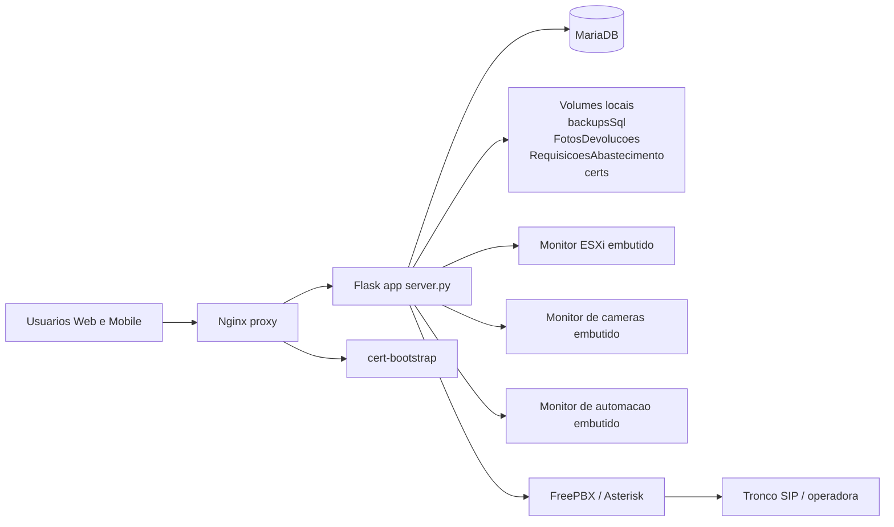
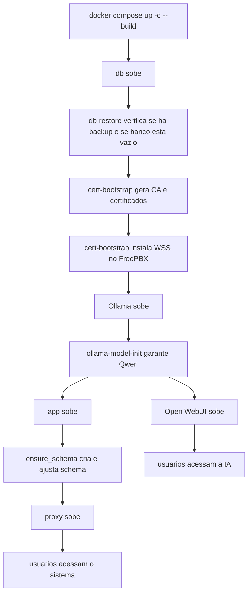
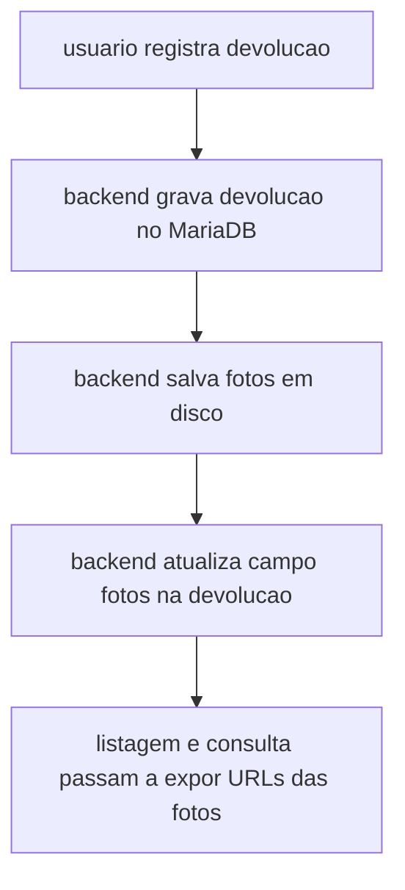
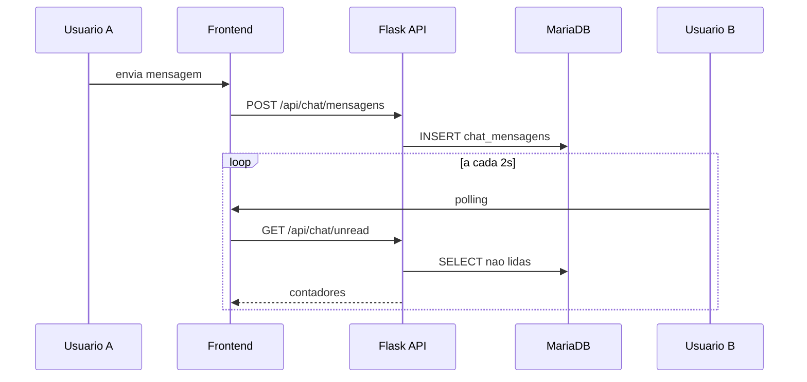
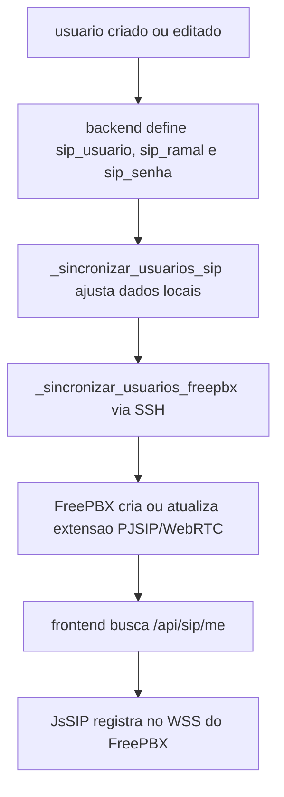
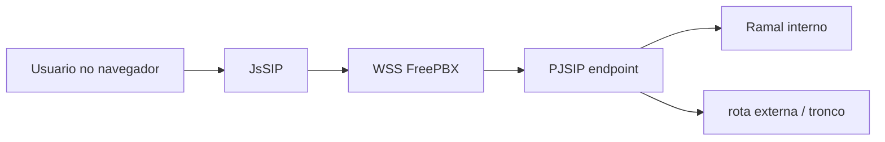
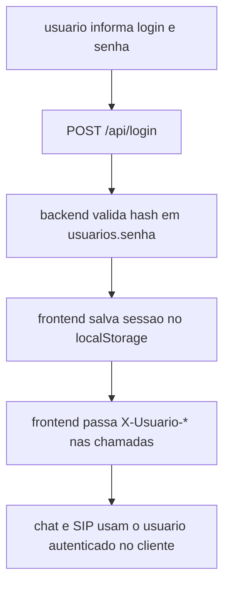
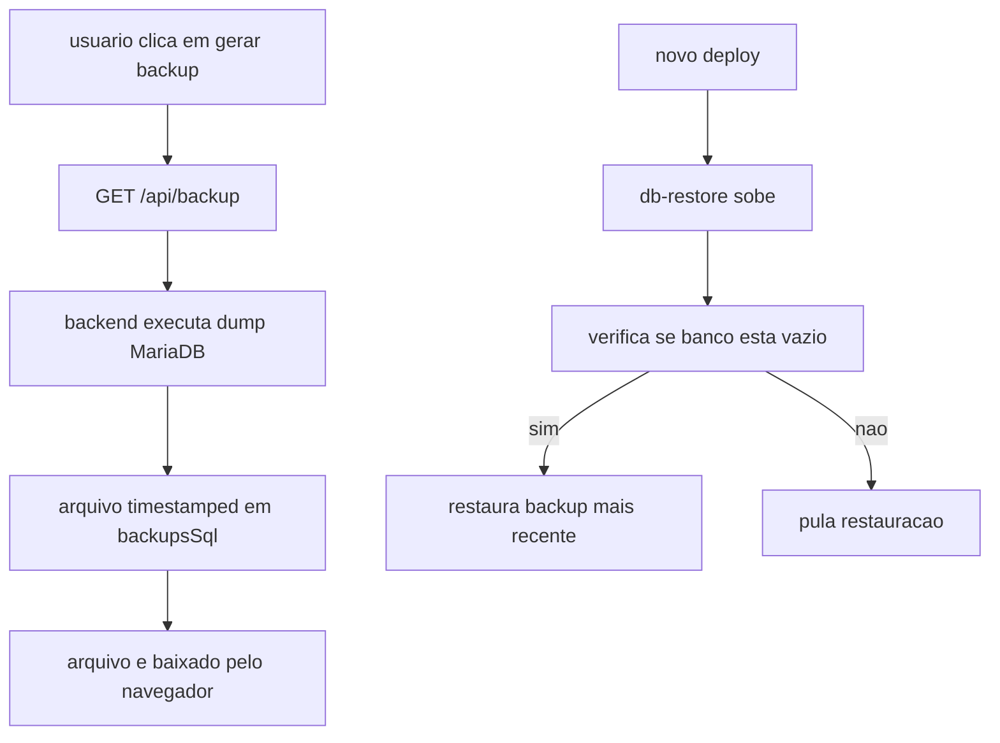
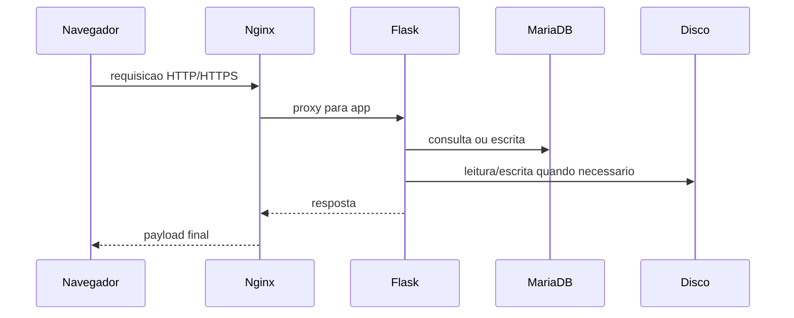

# Arquitetura e Funcionalidades do Sistema RioBranco

## 1. Visao geral

O projeto `RioBranco` e uma aplicacao web monolitica voltada para operacao interna. Ele concentra:

- controle operacional de fretes, cargas, devolucoes e cadastros
- controle de estoque com conferencia e importacao de XML da NF-e
- gestao de frota, abastecimentos, manutencoes e historico do veiculo
- modulo de comissao
- chat interno entre usuarios
- telefonia SIP/WebRTC no navegador integrada ao FreePBX
- monitoramento acoplado de ESXi/vCenter, cameras e automacao industrial
- backup SQL e bootstrap automatico de certificados
- portal HTML de documentacao servido pelo proprio backend em `/docs`

Do ponto de vista tecnico, a aplicacao segue um modelo simples e direto:

- frontend estatico sem build step, servido pelo proprio backend
- backend Flask unico em `server.py`
- banco principal MariaDB
- proxy reverso Nginx para HTTP/HTTPS
- apps auxiliares de monitor iniciados sob demanda

## 2. Stack tecnologica

### Backend

- Python 3.11
- Flask
- mysql-connector-python
- Paramiko
- ReportLab

### Frontend

- HTML unico em `RioBranco.html`
- JavaScript unico em `script.js`
- CSS unico em `style.css`
- JsSIP para WebRTC/SIP no navegador

### Infra

- Docker Compose
- Nginx
- MariaDB 10.11
- OpenSSL
- FFmpeg para cameras

## 3. Estrutura fisica principal

```text
RioBranco/
|- docker-compose.yml
|- Dockerfile
|- server.py
|- RioBranco.html
|- script.js
|- style.css
|- dashboards.html
|- sql/init_riobranco.sql
|- deploy/
|  |- certs/bootstrap_trust.py
|  |- db/restore-latest-backup.sh
|  |- sync-production-to-homolog.sh
|  |- nginx/
|- docs/
|- esxi/
|- cameras/
|- certs/
|- backupsSql/
|- sync-import/
|- FotosDevolucoes/
|- RequisicoesAbastecimento/
```

O monitor industrial fica em um projeto externo, por padrao
`/srv/sensoresMonitor/monitoramento-industrial-v5.0`, montado somente para
leitura no container em `/opt/automacao-monitor`.

## 4. Arquitetura em alto nivel



## 5. Servicos do docker-compose

### 5.1 `db`

Responsabilidade:

- banco de dados principal MariaDB
- armazena dados de negocio da aplicacao

Persistencia:

- volume `db_data`

### 5.2 `db-restore`

Responsabilidade:

- restaurar automaticamente o backup SQL mais recente quando o banco estiver vazio

Regras importantes:

- procura por `backup_*.sql` ou `backup_*.sql.gz`
- usa o diretorio definido em `RB_DB_BACKUP_PATH`
- so restaura se o banco estiver vazio, exceto quando `RB_DB_RESTORE_FORCE=1`

### 5.3 `cert-bootstrap`

Responsabilidade:

- gerar a CA interna
- emitir certificado HTTPS da aplicacao
- emitir certificado WSS do FreePBX
- instalar o certificado do FreePBX via SSH

Regras importantes:

- so um ambiente deve operar com `RB_CERT_BOOTSTRAP=1` quando varios ambientes apontam para o mesmo FreePBX
- as demais VMs devem usar `RB_CERT_BOOTSTRAP=0` para nao sobrescrever o WSS da producao

### 5.4 `ollama` e `ollama-model-init`

Responsabilidade:

- executar o servidor Ollama dentro do compose
- persistir os modelos em `ollama_data`
- baixar e validar `qwen2.5:3b` antes da aplicacao e do WebUI
- remover `qwen2.5:7b` depois que o novo modelo estiver validado

### 5.5 `open-webui`

Responsabilidade:

- publicar a interface conversacional da IA
- acessar o Ollama pela rede interna em `http://ollama:11434`
- usar `RB_AGENT_OLLAMA_MODEL` como modelo padrao
- usar uma imagem derivada com NumPy compativel com CPUs anteriores a x86-64-v2
- persistir usuarios, conversas e configuracoes em `open_webui_data`

### 5.6 `app`

Responsabilidade:

- backend Flask
- serve API, arquivos estaticos e integra os modulos

Caracteristicas:

- chama `ensure_schema()` no startup
- carrega `.env` automaticamente
- grava arquivos operacionais em volumes

### 5.7 `proxy`

Responsabilidade:

- publicar HTTP/HTTPS externamente
- encaminhar trafego para o Flask
- expor downloads de certificados e scripts

## 6. Fluxo de inicializacao do ambiente



## 7. Modelo de aplicacao

O sistema e majoritariamente um monolito com frontend estatico.

### 7.1 Frontend

O frontend usa um unico HTML com secoes internas:

- `dashboard`
- `estoque`
- `fretes`
- `cargas`
- `cadastros`
- `devolucoes`
- `gestaofrota`
- `comissao`
- `monitor`
- `comunicacao`
- `config`

Nao existe build, bundler ou SPA framework. A navegacao acontece por:

- manipulacao de DOM
- chamadas `fetch` para `/api/...`
- exibicao de secoes por JS

Arquivos centrais do frontend:

- `RioBranco.html`
  - estrutura unica com menu, dashboards, kanban, modais, estoque/NF-e e widget de comunicacao
- `script.js`
  - logica de navegacao, CRUD, dashboard, estoque, chat, SIP e drag and drop do kanban
- `style.css`
  - estilos globais e responsivos
- `dashboards.html`
  - modo TV/kiosk que abre `RioBranco.html` em um `iframe`, esconde menu e alterna as views de dashboard
- `docs/index.html`, `docs/documentacao.html` e `docs/diagramas.html`
  - portal HTML local para navegar na documentacao tecnica sem sair da aplicacao

### 7.2 Backend

`server.py` concentra:

- bootstrap de ambiente
- conexao com banco
- migracao de schema
- regras de negocio
- rotas Flask
- geracao de PDF
- proxy para apps auxiliares
- integracao com FreePBX
- gestao de certificados

## 8. Modulos funcionais

### 8.1 Dashboard

Objetivo:

- consolidar indicadores operacionais
- exibir visao resumida de fretes, frota e status

Rotas principais:

- `/api/dashboard`
- `/api/dashboard_frota`
- `/api/frota_resumo`
- `/api/frota_historico/<veiculo_id>`
- `/api/status`

#### 8.1.1 Kanban operacional de fretes

O kanban fica dentro da propria secao `dashboard` em `RioBranco.html`.

Ele serve para:

- dar visao instantanea do estagio operacional de cada frete
- organizar a fila de descarregamento, carregamento, entrega e retorno
- mudar rapidamente o `status` do frete sem abrir outra tela

Como usar:

1. abrir `Dashboard -> Resumo`
2. localizar o card do frete na coluna atual
3. no desktop, arrastar o card pelo cabecalho para a coluna de destino
4. no celular, usar o botao `Mover` do card ou o arraste por toque prolongado
5. usar `Salvar` quando editar nome, veiculo, motorista, carga ou observacao

Mapeamento das colunas para `fretes.status`:

- `chegada`
  - chegou com vasilhames
- `descarregado`
  - descarregado aguardando carga
- `liberado`
  - liberado para carregar
- `carregando`
  - carregando em andamento
- `carregado`
  - carregado e liberado para viagem
- `entregando`
  - viajando em entrega
- `retornando`
  - finalizado e retornando
- `paradoVasio`
  - legado para parado vazio por manutencao, quebra ou outros
- `paradoCarregado`
  - parado carregado por manutencao, quebra ou outros

Implementacao relevante:

- o frontend renderiza os cards dentro das colunas do kanban
- o drag and drop desktop e touch ficam em `script.js`
- a persistencia do novo status passa por `atualizarFreteCompleto(...)`
- fretes em `retornando` seguem gravados no banco e no historico; apos cerca de 24 horas o frontend deixa de exibi-los no kanban operacional

#### 8.1.2 Arquivo `dashboards.html`

`dashboards.html` e um wrapper HTML separado para uso em TV, monitor ou navegador em tela cheia.

Ele serve para:

- abrir somente o dashboard sem navegacao lateral
- alternar automaticamente entre as views `Resumo` e `Frota / Manutencao`
- manter uma tela de acompanhamento continuo para operacao

Como funciona:

- carrega `RioBranco.html?tv=1` dentro de um `iframe`
- injeta CSS para esconder menu, header e elementos de navegacao
- tenta usar `openDashboardView(..., "resumo"|"frota")` para trocar a view real do app
- faz rotacao automatica das views em intervalo fixo

Uso esperado:

- abrir `dashboards.html` diretamente no navegador da TV ou monitor dedicado
- deixar o navegador em fullscreen quando a tela for somente de exibicao
- usar as setas esquerda/direita para troca manual e a tecla `i` para ocultar o badge
- continuar usando `RioBranco.html` para operacao e edicao; `dashboards.html` e somente exibicao

### 8.2 Fretes, cargas e cadastros

Entidades centrais:

- `fretes`
- `cargas`
- `veiculos`
- `motoristas`
- `conferentes`
- `usuarios`

Comportamento:

- CRUD dos cadastros base
- gerenciamento do status do frete
- associacao entre frete, veiculo, motorista, entregador e carga
- menu `Cargas` dividido entre `Cadastro` e `Escala`
- escala operacional focada nos status `chegada`, `descarregado` e `liberado`, com resumo de pendencias de equipe
- cadastro de `motoristas` evoluido para colaboradores com papeis de motorista, entregador e ajudante
- validacao de duplicidade para impedir colaborador em dois veiculos ao mesmo tempo na escala operacional

Rotas:

- `/api/fretes`
- `/api/cargas`
- `/api/veiculos`
- `/api/motoristas`
- `/api/conferentes`
- `/api/usuarios`

Observacao importante:

- existem rotas genericas `GET/POST/PUT/DELETE /api/<tabela>` para parte do CRUD simples
- algumas entidades possuem rotas especializadas com validacoes proprias
- a API preserva os nomes tecnicos `/api/motoristas` e tabela `motoristas`, mesmo com a interface tratando essas pessoas como colaboradores

### 8.3 Devolucoes

Objetivo:

- registrar retorno de itens por frete
- armazenar observacoes por item
- anexar fotos

Persistencia:

- dados estruturados em MariaDB
- fotos em `FotosDevolucoes/devolucao_<id>/`

Fluxo:



Rotas principais:

- `/api/devolucoes`
- `/api/devolucoes/<id>`
- `/api/devolucoes/<id>/fotos`
- `/api/devolucoes/fotos/<path>`

### 8.4 Gestao de frota

Objetivo:

- registrar abastecimentos, manutencoes e trocas
- calcular historico operacional do veiculo
- alimentar dashboard de frota

Entidades:

- `abastecimentos`
- `manutencoes`
- `trocas_oleo`
- `trocas_pneu`

Regras relevantes:

- abastecimento nasce com status `liberado`
- conclusao muda para `abastecido`
- historico de km/l e calculado com base em abastecimentos concluidos
- cada veiculo possui `combustivel_padrao`, limitado a Diesel S10 ou Diesel 500
- Arla e permitido somente em veiculos cadastrados como Diesel S10

Rotas principais:

- `/api/abastecimentos`
- `/api/abastecimentos/liberar`
- `/api/abastecimentos/<id>/abastecer`
- `/api/abastecimentos/<id>` para edicao
- `/api/abastecimentos/<id>/importar_nfe`
- `/api/abastecimentos/<id>/pdf`
- `/api/manutencoes`
- `/api/trocas_oleo`
- `/api/trocas_pneu`
- `/api/lavagens`
- `/api/frota_relatorio`

### 8.5 Estoque e NF-e

Objetivo:

- registrar entradas e saidas de estoque
- importar XML oficial da NF-e
- auto cadastrar produtos faltantes
- consolidar a conferencia do transporte entre fabrica e almoxarifado

Entidades:

- `estoque_movimentos`
- `estoque_produtos`
- `estoque_conferencias`
- `estoque_conferencia_itens`
- `nfe_config`

Regras relevantes:

- o saldo e calculado a partir da soma de `entrada` e `saida`
- a importacao do XML gera ou atualiza uma conferencia pendente por chave de acesso
- a configuracao NF-e pode bloquear notas duplicadas no estoque e no abastecimento
- o modo `codbar_modo` do usuario define se o fluxo preferencial e bip/leitor ou camera/webcam
- o dashboard de estoque e separado do dashboard operacional de fretes

Rotas principais:

- `/api/dashboard_estoque`
- `/api/estoque`
- `/api/estoque/saldo`
- `/api/estoque/produtos`
- `/api/estoque/conferencias`
- `/api/estoque/conferencias/<id>`
- `/api/estoque/nfe/import`
- `/api/estoque/conferencias/<id>/confirmar`
- `/api/nfe/config`

### 8.6 Comissao

Objetivo:

- cadastrar parametros de comissao
- lancar movimentos
- emitir relatorios e PDF

Entidades:

- `comissao_lancamentos`
- `comissao_cadastros`
- `comissao_cidades`

Rotas principais:

- `/api/comissao/lancamentos`
- `/api/comissao/cadastros`
- `/api/comissao/cidades`
- `/api/comissao/relatorios`
- `/api/comissao/relatorios/pdf`

### 8.7 Comunicacao: chat interno

Objetivo:

- troca de mensagens entre usuarios cadastrados

Modelo tecnico:

- nao usa WebSocket
- usa polling no frontend a cada 2 segundos
- mensagens ficam na tabela `chat_mensagens`
- anexos ficam persistidos em `/data/app/ChatAnexos`

Fluxo:



Rotas principais:

- `/api/chat/conversa`
- `/api/chat/mensagens/<id>/anexo`
- `/api/chat/mensagens`
- `/api/chat/marcar_lidas`
- `/api/chat/unread`

### 8.8 Comunicacao: SIP/WebRTC

Objetivo:

- permitir ligacao interna entre ramais e, quando habilitado, discagem externa

Conceitos importantes:

- `sip_ramal`: extensao/ramal interno de 4 digitos
- `sip_usuario`: usuario de autenticacao SIP
- `sip_senha`: senha usada no registro SIP
- `sip_habilitado`: permissao para chamadas externas

Detalhe funcional importante:

- o cliente usa `sip_ramal` na URI SIP
- o cliente usa `sip_usuario` e `sip_senha` para autenticacao

Fluxo de provisionamento:



Fluxo de chamada:



Rotas principais:

- `/api/sip/config`
- `/api/sip/freepbx/sync`
- `/api/sip/me`
- `/api/sip/cert.pem`
- `/api/sip/cert.crt`
- `/api/ca/cert.pem`
- `/api/ca/cert.crt`
- `/api/certs.p12`
- `/api/certs.pfx`
- `/api/sip/windows-install.ps1`
- `/api/sip/linux-install.sh`
- `/api/sip/apple.mobileconfig`

Observacoes importantes:

- o sistema privilegia `FreePBX` como modo SIP ativo
- a operadora nao e acessada diretamente pelo navegador; o browser registra no FreePBX
- chamadas externas dependem de rota/tronco no FreePBX
- clientes precisam confiar na CA ou nos certificados do app e do WSS

### 8.9 Monitor ESXi

Objetivo:

- embutir um cliente web para ESXi/vCenter dentro da aplicacao principal

Modelo tecnico:

- app auxiliar versionado em `esxi/`
- iniciado sob demanda em porta local
- acessado via proxy reverso em `/monitor/esxi/`
- quando o host selecionado some do inventario, o frontend limpa a selecao antiga e escolhe o primeiro host disponivel
- o detalhe de licenca passou a exibir tempo restante em dias/horas para leitura operacional mais rapida

### 8.10 Monitor de cameras

Objetivo:

- listar cameras
- expor HLS/RTSP
- iniciar processos FFmpeg para streaming local quando necessario

Modelo tecnico:

- app Flask proprio em `cameras/server.py`
- usa SQLite e diretorios HLS no volume `cameras_data`
- o repositorio mantem apenas o codigo e o cadastro inicial necessario; banco e segmentos gerados nao sao versionados
- acessado via proxy em `/monitor/cameras/`

### 8.11 Monitor de automacao

Objetivo:

- acompanhar motores, leituras industriais e alarmes de sensores

Modelo tecnico:

- app Flask externo montado em `/opt/automacao-monitor`
- iniciado sob demanda em porta local
- banco SQLite persistido em `/data/app/automacao/homologacao.db`
- acessado via proxy em `/monitor/automacao/`
- usa `X-Forwarded-Prefix` para gerar URLs sob o prefixo do sistema principal

### 8.12 Portal de documentacao e artefatos operacionais

Objetivo:

- abrir a documentacao tecnica diretamente pela aplicacao
- manter um ponto de entrada unico para arquitetura, diagramas, operacao/deploy e API
- registrar snapshots e dumps importados usados em sincronizacoes operacionais

Componentes:

- `/docs`, `/docs/` e `/docs/index.html`
  - portal HTML servido pelo Flask
- `docs/documentacao.html`
  - viewer navegavel para os `.md`
- `docs/diagramas.html`
  - viewer focado em Mermaid
- `sync-import/`
  - diretorio versionado para snapshots SQL/tar.gz importados manualmente

Observacoes:

- o frontend principal abre o portal de docs diretamente em `/docs/index.html`
- o Nginx foi ajustado para preservar host e porta customizada no redirecionamento para `/docs/index.html`
- `sync-import/` nao substitui volumes nem restore automatico; ele serve como referencia operacional

## 9. Modelo de dados principal

### 9.1 MariaDB

Tabelas nucleares:

- `usuarios`
- `veiculos`
- `motoristas`
- `conferentes`
- `cargas`
- `fretes`
- `devolucoes`
- `abastecimentos`
- `manutencoes`
- `trocas_oleo`
- `trocas_pneu`
- `lavagens`
- `estoque_movimentos`
- `estoque_produtos`
- `estoque_conferencias`
- `estoque_conferencia_itens`
- `logs_exclusoes`
- `chat_mensagens`
- `comissao_lancamentos`
- `comissao_cadastros`
- `comissao_cidades`
- `sip_config`
- `nfe_config`
- `fretes_historico`

Relacionamentos mais importantes:

- `fretes` referencia `motoristas`, `veiculos` e `cargas`
- `fretes` referencia `motoristas` duas vezes, em `motorista_id` e `entregador_id`, alem de `veiculos` e `cargas`
- `devolucoes` referencia `fretes`, `veiculos` e `conferentes`
- `chat_mensagens` referencia `usuarios` em remetente e destinatario
- `estoque_conferencias` agrega itens em `estoque_conferencia_itens`
- `estoque_conferencia_itens` referencia produtos cadastrados em `estoque_produtos`
- dados de SIP por usuario ficam em `usuarios` e configuracao global em `sip_config`
- a configuracao global de NF-e fica em `nfe_config`

### 9.2 Arquivos e discos

Persistencia fora do banco:

- `FotosDevolucoes/`: imagens de devolucoes
- `RequisicoesAbastecimento/`: PDFs de abastecimento
- `backupsSql/`: dumps SQL usados no backup e no restore automatico
- `certs/`: CA e certificados emitidos
- `cameras/`: codigo-fonte do app de cameras
- `cameras_data`: banco SQLite e segmentos HLS gerados em runtime
- `/data/app/automacao/`: SQLite persistente do monitor de automacao
- `docs/`: fontes Markdown e viewers HTML da documentacao
- `sync-import/`: snapshots importados manualmente de producao para consulta ou reaproveitamento controlado

## 10. Fluxo de autenticacao do usuario



Observacoes importantes:

- a sessao web principal e mantida no `localStorage`
- o frontend renova a sessao por 8 horas quando consegue revalidar o usuario
- boa parte da identificacao do usuario em API usa headers `X-Usuario-*`
- isso simplifica a aplicacao, mas nao equivale a um modelo forte de RBAC ou sessao server-side

## 11. Fluxo de backup e restore



Pontos importantes:

- o backup salvo em `backupsSql/` e o mesmo elegivel para restore automatico
- o restore automatico nao substitui um banco ja em uso, salvo com `RB_DB_RESTORE_FORCE=1`

## 12. API por dominios

### Core e status

- `/api/status`
- `/api/monitor_boot`
- `/api/dashboard`
- `/api/dashboard_estoque`
- `/api/relatorio`
- `/api/backup`

### Cadastros e operacao

- `/api/fretes`
- `/api/cargas`
- `/api/usuarios`
- `/api/devolucoes`
- `/api/estoque/*`
- `/api/abastecimentos`
- `/api/manutencoes`
- `/api/trocas_oleo`
- `/api/trocas_pneu`
- `/api/lavagens`
- `/api/frota_relatorio`

### Chat e SIP

- `/api/chat/*`
- `/api/sip/*`
- `/api/nfe/config`
- `/api/ca/*`
- `/api/certs.*`

### Comissao

- `/api/comissao/*`

### Monitores proxied

- `/monitor/esxi/*`
- `/monitor/cameras/*`
- `/monitor/automacao/*`

### Documentacao HTML

- `/docs`
- `/docs/`
- `/docs/index.html`
- `/docs/documentacao.html`
- `/docs/diagramas.html`

## 13. Integracoes externas

### 13.1 FreePBX / Asterisk

Usos:

- registro WebRTC via WSS
- provisionamento automatico de extensoes via SSH
- exposicao de certificado WSS

Dependencias:

- `RB_FREEPBX_HOST`
- `RB_FREEPBX_SSH_USER`
- `RB_FREEPBX_SSH_PASS`
- WSS ativo no FreePBX

### 13.2 Tronco SIP / operadora

Usos:

- chamada externa a partir do FreePBX

Observacao:

- o navegador nao registra no provedor diretamente

### 13.3 ESXi / vCenter

Usos:

- monitoramento e operacoes administrativas via app incorporado

### 13.4 Cameras

Usos:

- visualizacao local HLS/RTSP
- transcodificacao e segmentacao com FFmpeg

## 14. Variaveis de ambiente mais importantes

### Banco

- `RB_DB_NAME`
- `RB_DB_USER`
- `RB_DB_PASSWORD`
- `RB_DB_ROOT_PASSWORD`
- `RB_DB_BACKUP_PATH`
- `RB_DB_RESTORE_FORCE`

### HTTPS e certificados

- `RB_ENABLE_HTTPS`
- `RB_SERVER_NAME`
- `RB_PUBLIC_BASE_URL`
- `RB_CERT_BOOTSTRAP`
- `RB_CA_CERT_CN`
- `RB_CERT_FORCE_REISSUE`
- `RB_CERT_APP_HOSTS`
- `RB_CERT_PBX_HOSTS`

### FreePBX / SIP

- `RB_FREEPBX_HOST`
- `RB_FREEPBX_SSH_PORT`
- `RB_FREEPBX_SSH_USER`
- `RB_FREEPBX_SSH_PASS`
- `RB_FREEPBX_PJSIP_TRANSPORT`
- `RB_FREEPBX_PJSIP_ALLOW`
- `RB_SIP_FREEPBX_WS_URL`
- `RB_SIP_FREEPBX_DOMINIO`
- `RB_SIP_FREEPBX_REGISTRAR_SERVER`

### ESXi

- `ESXI_HOST`
- `ESXI_USER`
- `ESXI_PASS`
- `ESXI_SSH_PORT`

## 15. Pontos de atencao operacionais

### 15.1 Monolito intencional

Vantagens:

- deploy simples
- baixo atrito de manutencao
- menor custo de coordenacao

Trade-off:

- `server.py` concentra muitas responsabilidades
- qualquer alteracao de backend afeta um unico ponto de entrada

### 15.2 Migracao automatica de schema

O sistema usa `ensure_schema()` no startup para:

- criar tabelas faltantes
- adicionar colunas novas
- bootstrap de configuracoes SIP

Isso reduz trabalho operacional, mas exige cuidado em mudancas destrutivas de schema.

### 15.3 Sessao e seguranca

Pontos atuais:

- login do sistema usa hash em `usuarios.senha`
- `sip_senha` e armazenada separadamente para interoperar com SIP
- o frontend guarda sessao em `localStorage`
- nao ha camada formal de permissao por rota ou RBAC completo

### 15.4 FreePBX compartilhado entre ambientes

Se producao e homologacao apontarem para o mesmo FreePBX:

- somente um ambiente deve instalar o certificado WSS
- somente um ambiente deve ser o "dono" do bootstrap de certificado

### 15.5 Chat por polling

O chat nao usa WebSocket proprio. Isso implica:

- simplicidade de implementacao
- mais chamadas HTTP recorrentes
- latencia de atualizacao ligada ao intervalo de polling

## 16. Caminho de uma requisicao tipica



## 17. Resumo executivo

O sistema RioBranco e uma plataforma operacional interna monolitica, com foco em simplicidade de deploy e integracao direta com a operacao. Seus diferenciais arquiteturais sao:

- frontend sem build e backend unico
- banco MariaDB central com schema evolutivo automatico
- modulo de estoque/NF-e integrado ao mesmo monolito operacional
- monitores ESXi, cameras e automacao embutidos via proxy
- comunicacao interna unindo chat e SIP/WebRTC
- bootstrap automatico de certificados com CA interna
- backup e restore automatico orientado a arquivos SQL
- portal `/docs` servido pelo mesmo backend para reduzir dependencia de conhecimento tacito

Os pontos que merecem mais atencao em manutencao futura sao:

- crescimento de responsabilidade dentro de `server.py`
- seguranca da camada de autenticacao e autorizacao
- disciplina no uso de `RB_CERT_BOOTSTRAP` em ambientes compartilhados
- observabilidade de chamadas SIP, polling do chat e integracoes externas
