# Diagramas e Processos do Sistema RioBranco

## 1. Objetivo

Este documento agrupa diagramas Mermaid focados em processo, operacao e integracao.

Ele complementa:

- `ARQUITETURA_SISTEMA.md`
- `OPERACAO_E_DEPLOY.md`
- `API_E_DADOS.md`

## 2. Mapa macro do sistema

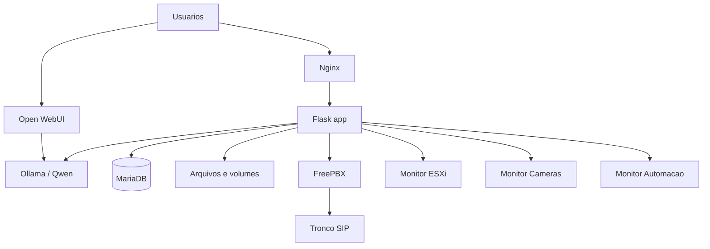

## 3. Processo de deploy completo

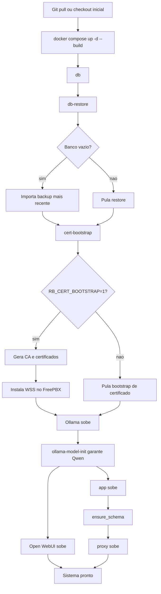

## 4. Processo de inicializacao do backend

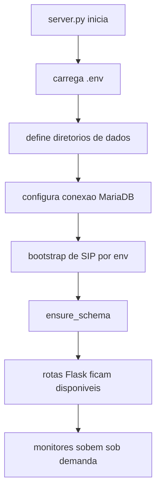

## 5. Fluxo de requisicao web

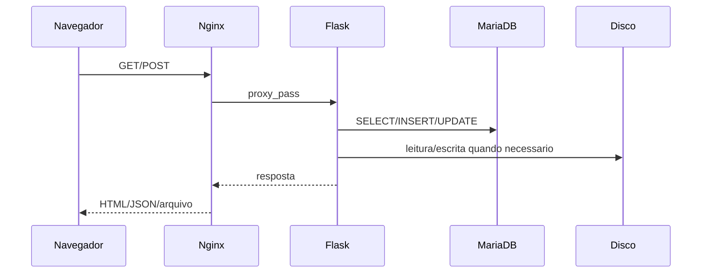

## 6. Processo de login e sessao

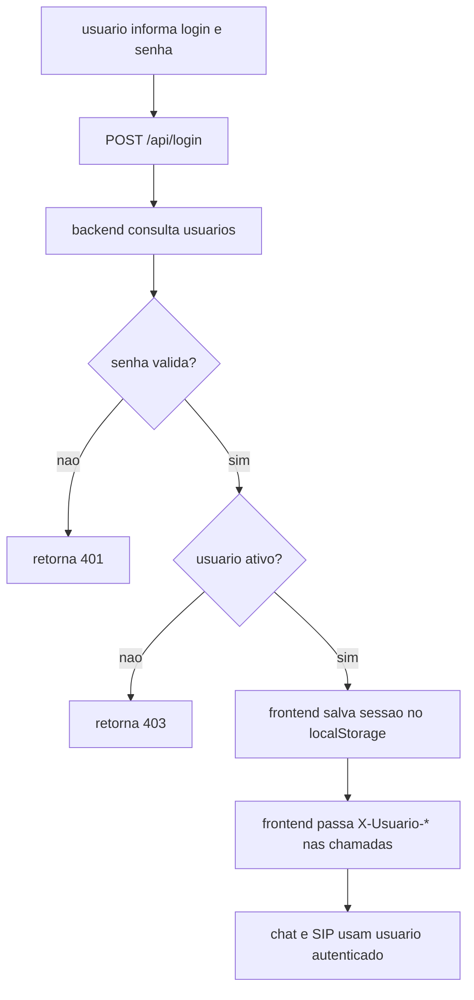

## 7. Processo de criacao ou edicao de usuario

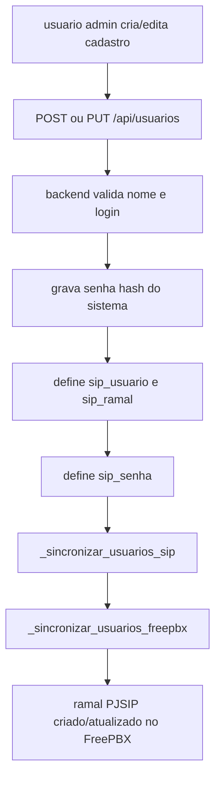

## 8. Processo de sincronizacao SIP no FreePBX

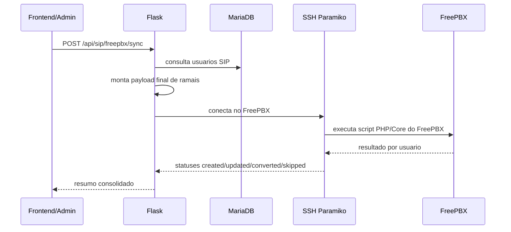

## 9. Processo de registro SIP do navegador

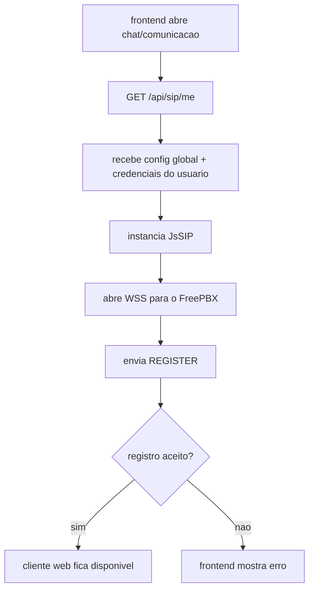

## 10. Chamada SIP interna

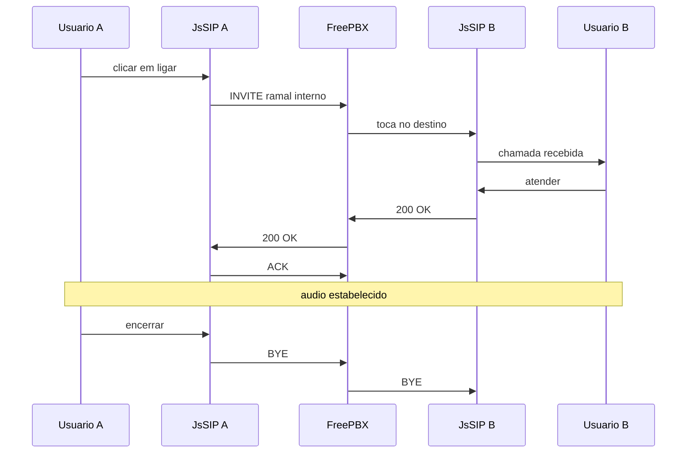

## 11. Chamada SIP externa

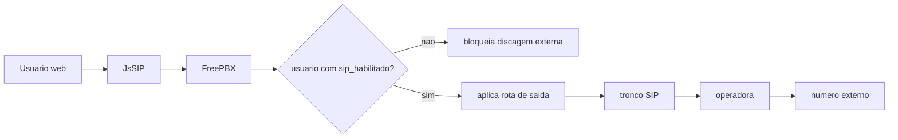

## 12. Processo de backup SQL

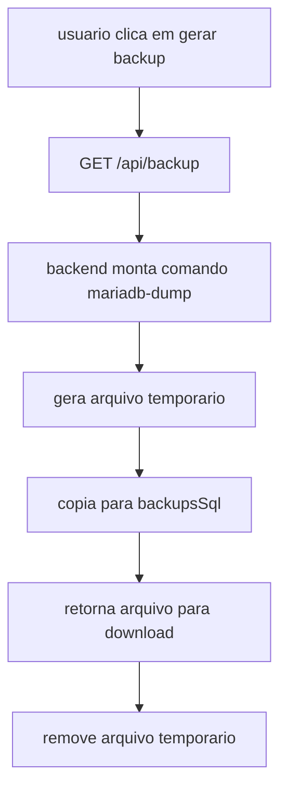

## 13. Processo de restore automatico

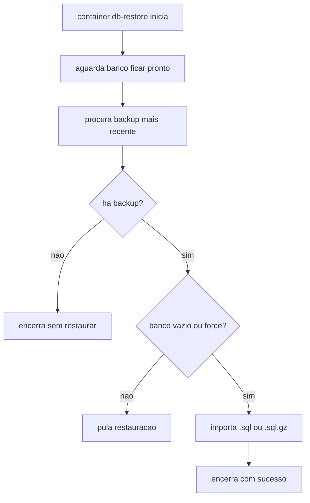

## 14. Processo de devolucao com fotos

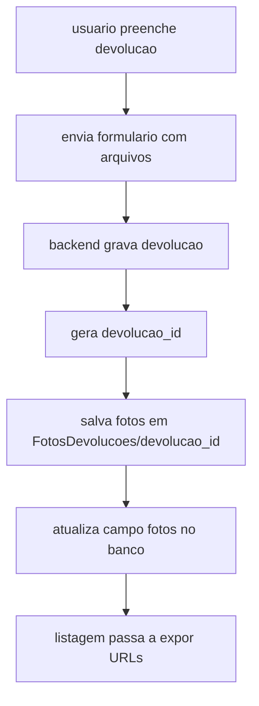

## 15. Processo de abastecimento

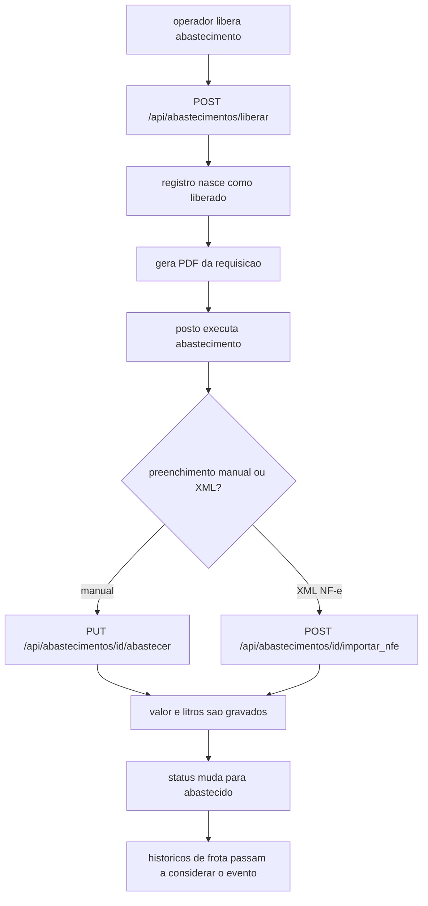

## 16. Processo de chat interno

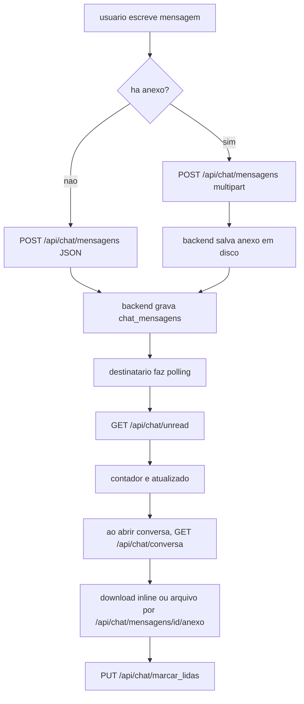

## 17. Processo do monitor ESXi

```mermaid
flowchart LR
    A[usuario abre aba Monitor ESXi] --> B[/monitor/esxi]
    B --> C[backend verifica app auxiliar]
    C --> D{processo rodando?}
    D -->|nao| E[inicia app.py do modulo ESXi]
    D -->|sim| F[usa processo existente]
    E --> G[proxy para porta local do monitor]
    F --> G
    G --> H[usuario interage com ESXi/vCenter]
```

## 18. Processo do monitor de cameras

```mermaid
flowchart TD
    A[usuario abre monitor de cameras] --> B[/monitor/cameras]
    B --> C[backend garante server.py de cameras]
    C --> D[app de cameras consulta SQLite]
    D --> E[lista cameras]
    E --> F{camera RTSP?}
    F -->|sim| G[FFmpeg pode gerar HLS local]
    F -->|nao| H[usa HLS configurado]
    G --> I[stream entregue ao navegador]
    H --> I
```

## 19. Processo do monitor de automacao

```mermaid
flowchart TD
    A[usuario abre Monitor Automacao] --> B[/monitor/automacao]
    B --> C[backend garante app.py industrial]
    C --> D[app usa prefixo encaminhado pelo proxy]
    D --> E[consulta SQLite em app_data/automacao]
    F[sensor envia POST api/leitura] --> G[leitura e alarmes sao persistidos]
    G --> E
    E --> H[telas de motores, historico, alarmes e tempo real]
```

## 20. Processo de bootstrap de certificados

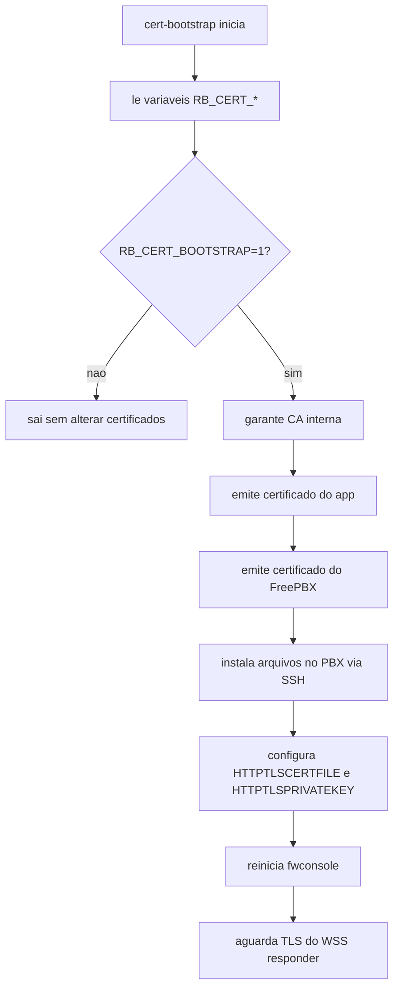

## 21. Processo de onboarding de certificados no cliente

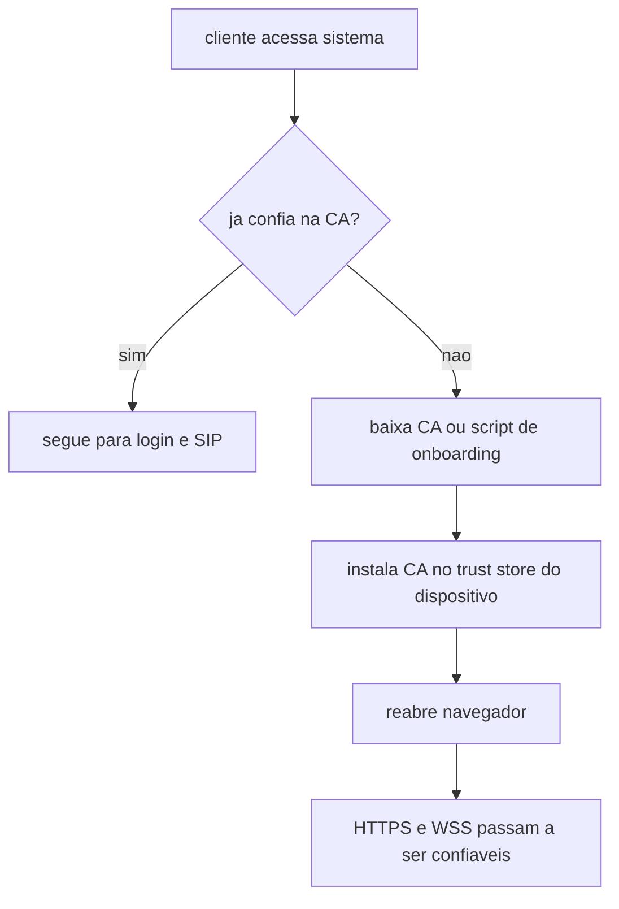

## 22. Processo de diagnostico SIP

```mermaid
flowchart TD
    A[cliente SIP indisponivel] --> B[verificar /api/status]
    B --> C{endpoint SIP acessivel?}
    C -->|nao| D[problema de rede ou porta]
    C -->|sim| E[verificar confianca do certificado]
    E --> F{cliente confia na CA?}
    F -->|nao| G[instalar CA]
    F -->|sim| H[verificar /api/sip/me]
    H --> I{credenciais coerentes?}
    I -->|nao| J[sincronizar FreePBX]
    I -->|sim| K[inspecionar logs do Asterisk]
```

## 23. Processo de remocao de usuario

```mermaid
flowchart TD
    A[admin exclui usuario] --> B[DELETE /api/usuarios/id]
    B --> C[backend remove do MariaDB]
    C --> D[registra logs_exclusoes]
    D --> E{usuario tinha ramal?}
    E -->|nao| F[fim]
    E -->|sim| G[tenta remover extensao no FreePBX]
    G --> F
```

## 24. Processo de leitura recomendado

```mermaid
flowchart LR
    A[Arquitetura] --> B[Diagramas]
    B --> C[Operacao e Deploy]
    C --> D[API e Dados]
```

## 25. Processo de estoque com XML da NF-e

```mermaid
flowchart TD
    A[operador bipa chave ou escolhe XML] --> B[POST /api/estoque/nfe/import]
    B --> C[backend parseia XML oficial]
    C --> D{nota duplicada?}
    D -->|sim| E[retorna conflito]
    D -->|nao| F[gera ou atualiza conferencia]
    F --> G[auto cadastra produtos faltantes]
    G --> H[preenche itens da conferencia]
    H --> I[operador ajusta quantidades]
    I --> J[POST /api/estoque/conferencias/id/confirmar]
    J --> K[backend grava movimentos de estoque]
    K --> L[saldo e dashboard_estoque sao atualizados]
```

## 26. Processo de sincronizacao producao -> homologacao

```mermaid
flowchart TD
    A[operador executa sync-production-to-homolog.sh] --> B[valida RB_CERT_BOOTSTRAP=0]
    B --> C[opcional: git pull da branch configurada]
    C --> D[stop app e proxy da homologacao]
    D --> E[backup do banco local em sync-backups]
    E --> F[baixa dump da producao via /api/backup]
    F --> G[importa dump no banco da homologacao]
    G --> H{sync volumes?}
    H -->|app_data| I[copia /data/app remoto para o volume local]
    H -->|cameras_data| J[copia /data/cameras remoto para o volume local]
    I --> K[sube app e proxy]
    J --> K
    G --> K
    K --> L[homologacao alinhada com a producao]
```

## 27. Processo do portal `/docs`

```mermaid
flowchart TD
    A[usuario abre Docs no menu] --> B[frontend abre /docs/index.html]
    B --> C[Nginx preserva host e porta no redirect]
    C --> D[Flask serve docs/index.html]
    D --> E[usuario escolhe arquitetura, diagramas, operacao ou API]
    E --> F[viewer HTML carrega o Markdown versionado]
```

## 28. Observacoes finais

Os diagramas deste arquivo mostram o comportamento pretendido do sistema com base no codigo atual. Eles sao especialmente uteis para:

- onboarding tecnico
- troubleshooting
- planejamento de mudancas
- explicacao de fluxo para outras equipes

Quando houver mudanca relevante de arquitetura, SIP, persistencia ou deploy, este documento deve ser atualizado junto com os demais arquivos em `docs/`.
