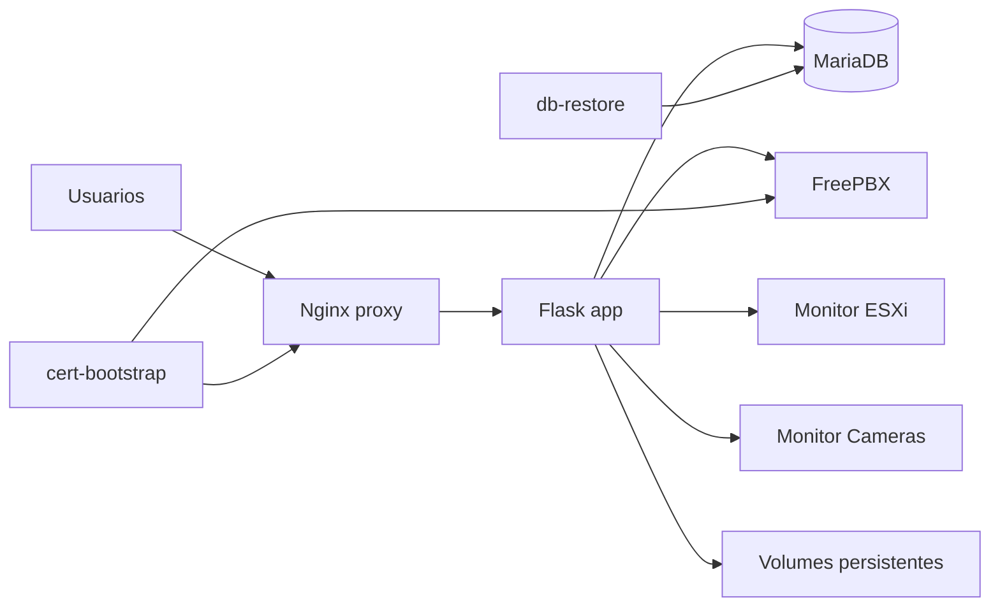
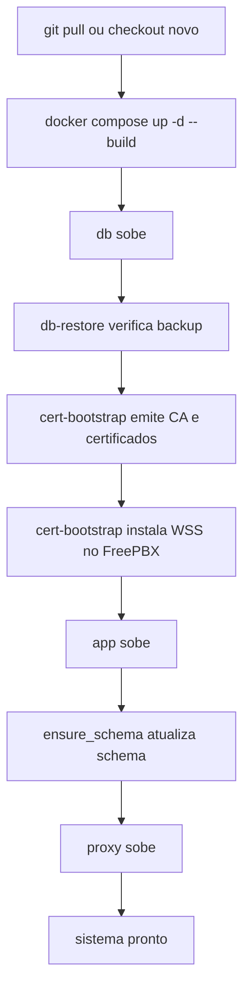

# Operacao e Deploy do Sistema RioBranco

## 1. Objetivo

Este documento descreve como subir, atualizar, validar e operar o sistema em ambientes como producao e homologacao.

Ele foi escrito para manter o deploy o mais automatico possivel, com foco em:

- bootstrap automatico de banco, certificados e app
- restauracao automatica de backup quando aplicavel
- minimizacao de passos manuais em clientes SIP/WebRTC
- padronizacao entre VMs

## 2. Topologia operacional



## 3. Pre-requisitos

### Host

- Docker e Docker Compose operacionais
- conectividade de rede entre a VM do app e o FreePBX
- portas publicadas livres
- armazenamento persistente para volumes

### Dependencias externas

- FreePBX/Asterisk acessivel por SSH
- WSS/HTTP do FreePBX habilitado
- tronco SIP funcional no FreePBX para chamadas externas
- ESXi/vCenter acessivel, se o monitor for usado

## 4. Arquivos e diretorios importantes

- `.env`
- `.env.example`
- `docker-compose.yml`
- `deploy/db/restore-latest-backup.sh`
- `deploy/sync-production-to-homolog.sh`
- `deploy/certs/bootstrap_trust.py`
- `deploy/nginx/http.conf.template`
- `deploy/nginx/https.conf.template`
- `docs/index.html`
- `certs/`
- `backups sql/`
- `Relatorios/`
- `nfe-cache/`
- `sync-import/`

Observacao adicional:

- o OCR de DANFE por foto depende das dependencias `Pillow`, `pytesseract`, `tesseract-ocr` e `tesseract-ocr-por` estarem presentes na imagem do `app`
- o OCR focado nos itens tambem depende de `rapidocr` e `onnxruntime`; na primeira execucao o motor pode baixar modelos para o container
- a alternativa em nuvem usa `Azure Document Intelligence`; configure endpoint, chave, modelo e versao da API em `Config > NF-e` antes de usar o botao de leitura dos itens via Azure
- para OCR de fotos grandes, o proxy usa timeouts maiores; depois de alterar os templates do Nginx, recrie pelo menos `proxy`
- o monitor de cameras foi reorganizado para operacao desktop: grid lateral de cameras clicaveis e player dominante na largura restante da tela
- o cadastro de novas cameras fica em `Config > Cameras`; o monitor ficou focado em visualizacao e playback
- no portal assistido da NF-e, a consulta publica pode abrir com a chave bipada ja na URL, reduzindo o processo operacional ao `reCAPTCHA` e ao uso do bookmarklet

## 5. Variaveis de ambiente criticas

### 5.1 Banco

- `RB_DB_NAME`
- `RB_DB_USER`
- `RB_DB_PASSWORD`
- `RB_DB_ROOT_PASSWORD`
- `RB_DB_BACKUP_PATH`
- `RB_DB_RESTORE_FORCE`

### 5.2 HTTPS e certificados

- `RB_ENABLE_HTTPS`
- `RB_SERVER_NAME`
- `RB_PUBLIC_BASE_URL`
- `RB_HTTP_PORT`
- `RB_HTTPS_PORT`
- `RB_HTTP_BIND`
- `RB_HTTPS_BIND`
- `RB_CERT_BOOTSTRAP`
- `RB_CA_CERT_CN`
- `RB_CA_CERT_DAYS`
- `RB_SERVER_CERT_DAYS`
- `RB_CERT_FORCE_REISSUE`
- `RB_CERT_APP_HOSTS`
- `RB_CERT_PBX_HOSTS`

### 5.3 FreePBX

- `RB_FREEPBX_HOST`
- `RB_FREEPBX_SSH_PORT`
- `RB_FREEPBX_SSH_USER`
- `RB_FREEPBX_SSH_PASS`
- `RB_FREEPBX_PJSIP_TRANSPORT`
- `RB_FREEPBX_PJSIP_ALLOW`

### 5.4 SIP frontend

- `RB_SIP_HABILITADO`
- `RB_SIP_MODO_ATIVO`
- `RB_SIP_FREEPBX_WS_URL`
- `RB_SIP_FREEPBX_DOMINIO`
- `RB_SIP_FREEPBX_REGISTRAR_SERVER`

### 5.5 Monitores

- `ESXI_HOST`
- `ESXI_USER`
- `ESXI_PASS`
- `ESXI_SSH_PORT`
- `RB_VSPHERE_CLIENT_PATH`

### 5.6 Sincronizacao producao para homologacao

- `RB_SYNC_PROD_BASE_URL`
- `RB_SYNC_PROD_HOST`
- `RB_SYNC_PROD_SSH_USER`
- `RB_SYNC_PROD_SSH_KEY`
- `RB_SYNC_BRANCH`
- `RB_SYNC_CODE`
- `RB_SYNC_DB`
- `RB_SYNC_APP_DATA`
- `RB_SYNC_CAMERAS_DATA`
- `RB_SYNC_CURL_INSECURE`
- `RB_SYNC_BACKUP_DIR`

## 6. Padrao de `.env`

### 6.1 Producao oficial

Use este modelo na VM que e dona do certificado WSS do FreePBX:

```env
RB_ENABLE_HTTPS=1
RB_SERVER_NAME=192.168.200.254
RB_PUBLIC_BASE_URL=https://192.168.200.254:8443
RB_HTTP_PORT=8080
RB_HTTPS_PORT=8443
RB_CERT_BOOTSTRAP=1
RB_CERT_APP_HOSTS=192.168.200.254
RB_CERT_PBX_HOSTS=192.168.200.253,freepbx.sangoma.local,localhost,127.0.0.1
RB_FREEPBX_HOST=192.168.200.253
RB_FREEPBX_SSH_PORT=22
RB_FREEPBX_SSH_USER=root
RB_FREEPBX_SSH_PASS=troque-esta-senha
```

### 6.2 Homologacao ou VM secundaria

Use este modelo quando a VM apontar para o mesmo FreePBX da producao:

```env
RB_ENABLE_HTTPS=1
RB_SERVER_NAME=192.168.200.250
RB_PUBLIC_BASE_URL=https://192.168.200.250:8443
RB_HTTP_PORT=8080
RB_HTTPS_PORT=8443
RB_CERT_BOOTSTRAP=0
RB_FREEPBX_HOST=192.168.200.253
RB_FREEPBX_SSH_PORT=22
RB_FREEPBX_SSH_USER=root
RB_FREEPBX_SSH_PASS=troque-esta-senha
```

Regra critica:

- so uma VM deve usar `RB_CERT_BOOTSTRAP=1` para o mesmo FreePBX

## 7. Fluxo de deploy



## 8. Primeira subida

### 8.1 Preparacao

1. Copie `.env.example` para `.env`.
2. Ajuste senhas e IPs.
3. Confirme o papel da VM:
   - producao oficial: `RB_CERT_BOOTSTRAP=1`
   - secundaria/homologacao: `RB_CERT_BOOTSTRAP=0`

### 8.2 Comando

```bash
docker compose up -d --build
```

### 8.3 Validacao inicial

```bash
docker compose ps
docker compose logs --tail=200 cert-bootstrap
docker compose logs --tail=200 app
docker compose logs --tail=200 proxy
```

Checklist:

- `db` deve estar `healthy`
- `db-restore` deve concluir com sucesso ou pular restauracao
- `cert-bootstrap` deve concluir com sucesso ou sair rapidamente quando desabilitado
- `app` deve subir sem erro de schema
- `proxy` deve publicar as portas esperadas

## 9. Atualizacao de codigo

### 9.1 Fluxo padrao

```bash
./update.sh
```

Equivalente manual:

```bash
git pull --ff-only origin main
docker compose up -d --build
```

### 9.2 Quando usar reemissao forcada de certificados

Use somente quando houver troca de IP, DNS, CA ou problema real de certificado:

```bash
RB_CERT_FORCE_REISSUE=1 docker compose up -d --build cert-bootstrap app proxy
```

### 9.3 Atualizacao de app/proxy sem acionar restore

Quando a necessidade for atualizar apenas codigo e interface, mantendo `db` e `db-restore` fora do ciclo:

```bash
git pull --ff-only origin main
docker compose up -d --build --no-deps app proxy
```

Observacao importante:

- quando a atualizacao envolver apenas monitor de cameras, portal assistido da NF-e ou telas do frontend, `docker compose up -d --build --no-deps app proxy` costuma ser suficiente

- isso evita subir `db-restore`, mas o backend ainda executa `ensure_schema()` ao inicializar

### 9.4 Validacao rapida em homologacao para chat, SIP e vendas

Quando a mudanca for apenas de interface/backend do app:

```bash
docker compose up -d --build app proxy
docker compose logs --tail=150 app
```

Checklist rapido:

- abrir `Config -> Vendas`
- usar `Importar relatorio CSV` para subir um arquivo manualmente ou `Importar do diretorio` para usar o CSV detectado no servidor
- confirmar que o arquivo entrou na lista de caches
- marcar no checkbox qual relatorio deve ficar `Em uso`
- abrir `Vendas -> Relatorio` e validar totais e detalhamento por vendedor
- abrir o chat interno e validar o beep de nova mensagem
- validar chamada SIP de saida e entrada para confirmar tom de discagem e toque de chamada

Observacao:

- navegadores podem exigir uma interacao previa do usuario na pagina antes de liberar audio

## 10. Volumes e persistencia

Persistencia principal:

- `db_data`
  - MariaDB
- `app_data`
  - anexos do chat, fotos, requisicoes, cache local de XML da NF-e e uploads manuais do modulo de vendas

### 10.1 Importacao persistida de vendas

O modulo `Vendas -> Relatorio` importa o CSV para o MariaDB para evitar reler o arquivo bruto inteiro a cada consulta.

Diretorios/arquivos relevantes:

- `Relatorios/`
  - origem atual do CSV externo
  - precisa estar montada em `/app/Relatorios` no container `app` para o botao `Importar do diretorio` enxergar o arquivo atual

- `DATA_ROOT/vendas-cache/`
  - uploads manuais do CSV feitos pela tela `Config -> Vendas`

- `DATA_ROOT/vendas-config.json`
  - configuracao da fonte do modulo de vendas

- tabela `vendas_relatorios_importados`
  - lista dos relatorios importados, status e qual esta ativo

- tabela `vendas_relatorio_itens`
  - linhas importadas do relatorio para consulta por vendedor e por total, com agrupadores por cidade e por produto

Fluxo atual:

1. o operador aponta a origem em `Config -> Vendas`
2. pode importar um CSV manualmente pelo botao `Importar relatorio CSV` ou usar `Importar do diretorio`
3. cada importacao entra na lista de relatorios importados
4. um checkbox define qual relatorio importado esta `Em uso`
5. o relatorio de vendas passa a ler somente o import ativo salvo no banco
6. a tela de `Vendas -> Relatorio` exibe totais por vendedor, cidade e produto
7. ao excluir um relatorio importado, o sistema remove o registro e as linhas dele do banco

- `app_data`
  - dados persistentes da aplicacao

- `cameras_data`
  - persistencia das cameras

Persistencia por bind mount:

- `backups sql/`
  - dumps SQL

- `certs/`
  - CA e certificados emitidos

- `esxi/`
  - monitor ESXi versionado

- `sync-backups/`
  - backups locais gerados antes da sincronizacao producao -> homologacao

- `sync-import/`
  - snapshots versionados de SQL e dados importados manualmente para referencia operacional

## 11. Backup e restore

### 11.1 Geracao de backup

Pelo frontend:

- `Config` -> gerar backup SQL

Pela API:

```bash
curl -k -O https://HOST:PORT/api/backup
```

Comportamento:

- o backend executa `mariadb-dump --skip-ssl`
- salva o dump em `backups sql/backup_YYYYMMDD_HHMMSS.sql`
- devolve o mesmo arquivo no download HTTP

### 11.2 Restore automatico

O container `db-restore`:

- localiza o backup mais recente em `backups sql/`
- verifica se o banco esta vazio
- importa o arquivo automaticamente apenas quando o banco estiver vazio

Para forcar:

```bash
RB_DB_RESTORE_FORCE=1 docker compose up db-restore
```

### 11.3 O que nunca fazer sem necessidade

- nao usar `docker compose down -v`
- nao apagar `db_data`
- nao limpar `backups sql/` sem politica definida

### 11.4 Sincronizacao producao -> homologacao

O projeto possui um fluxo assistido para alinhar homologacao com o estado atual da producao:

```bash
./deploy/sync-production-to-homolog.sh
```

Comportamento:

- valida que a homologacao esta com `RB_CERT_BOOTSTRAP=0`
- opcionalmente atualiza o codigo local pela branch configurada
- para `app` e `proxy` antes da sincronizacao
- gera backup local do banco da homologacao em `sync-backups/`
- baixa o dump atual da producao via `/api/backup`
- apos importar o banco, redefine `nfe_config` para defaults seguros de homologacao por padrao:
- `habilitado=0`
- `ambiente=homologacao`
- `ultimo_nsu=''`
- `auto_manifestar_ciencia=0`
- opcionalmente sincroniza os volumes `/data/app` e `/data/cameras`
- sobe novamente `app` e `proxy`

Cuidados:

- revisar `RB_SYNC_*` no `.env` antes de usar
- se realmente precisar preservar a configuracao NF-e clonada da producao, usar `RB_SYNC_RESET_NFE_CONFIG=0`
- usar chave SSH quando necessario via `RB_SYNC_PROD_SSH_KEY`
- tratar `sync-import/` como artefato de referencia, nao como volume automatico do deploy

## 12. Certificados e onboarding de clientes

## 12.1 Estrategia atual

O sistema foi padronizado para usar:

- uma CA interna
- certificado HTTPS da aplicacao assinado por essa CA
- certificado WSS do FreePBX assinado pela mesma CA

Objetivo:

- reduzir downloads manuais
- permitir que clientes confiem em uma unica CA

## 12.2 Endpoints de distribuicao

- `/api/ca/cert.pem`
- `/api/ca/cert.crt`
- `/api/sip/windows-install.ps1`
- `/api/sip/linux-install.sh`
- `/api/sip/apple.mobileconfig`
- `/api/certs.p12`
- `/api/certs.pfx`

## 12.3 Comportamento do Nginx

Mesmo quando o cliente ainda nao confia no `8443`, o proxy permite baixar os arquivos de onboarding por HTTP nas rotas de certificados e scripts antes do redirect completo para HTTPS.

Atualizacao recente:

- `/docs` e `/docs/` redirecionam para `/docs/index.html` preservando host e porta customizada

## 12.4 Regra pratica por plataforma

- Windows:
  - preferir o script PowerShell

- Linux desktop:
  - preferir o script shell

- iPhone/iPad:
  - preferir o `.mobileconfig`

- Android:
  - preferir o `.crt` da CA

## 13. Operacao de SIP e FreePBX

### 13.1 Bootstrap de usuario SIP

Ao criar, editar ou logar um usuario:

- o backend define ou corrige `sip_usuario`, `sip_ramal` e `sip_senha`
- depois tenta sincronizar o ramal no FreePBX

### 13.2 Regras de negocio

- `sip_ramal` e o ramal interno de 4 digitos
- `sip_usuario` e o identificador de autenticacao SIP
- `sip_senha` e a senha usada no softphone/browser
- `usuarios.senha` e o hash da senha do sistema, nao deve ser usada como senha SIP
- `sip_habilitado=1` libera chamadas externas

### 13.3 Validacoes importantes

```bash
docker compose exec app env | grep RB_FREEPBX
curl -k https://HOST:PORT/api/status
```

No FreePBX:

```bash
asterisk -rx "http show status"
asterisk -rx "pjsip show endpoints"
asterisk -rx "pjsip show contacts"
```

## 13.4 NF-e / Receita

Para o passo a passo detalhado da integracao operacional de NF-e / Receita, consulte:

- `NFE_RECEITA_E_INTEGRACAO.md`

Regra pratica importante:

- o fluxo atual recomendado continua baseado no XML oficial da NF-e
- o modo `portal_assistido` abre a consulta oficial e apoia o operador
- o modo `certificado_digital` hoje registra configuracao, mas nao executa download automatico no backend

## 14. Runbook de verificacao rapida

### 14.1 Estado geral

```bash
docker compose ps
curl -k https://HOST:PORT/api/status
curl -k https://HOST:PORT/docs/index.html
```

### 14.2 Logs

```bash
docker compose logs --tail=200 app
docker compose logs --tail=200 proxy
docker compose logs --tail=200 cert-bootstrap
docker compose logs --tail=200 db
```

### 14.3 Validacao de HTTPS

```bash
curl -vk https://HOST:PORT/
openssl s_client -connect HOST:PORT -servername HOST </dev/null
```

### 14.4 Validacao de WSS do FreePBX

```bash
openssl s_client -connect PBX:8089 -servername PBX </dev/null
```

## 15. Troubleshooting

### 15.1 `https://host:8443` nao abre

Verifique:

- `RB_ENABLE_HTTPS=1`
- `proxy` em execucao
- arquivos em `certs/fullchain.pem` e `certs/privkey.pem`
- logs do `proxy`

### 15.2 `Cliente web: SIP desconectado do servidor`

Causas comuns:

- cliente nao confia na CA
- WSS do FreePBX inacessivel
- certificado do FreePBX nao bate com host/IP

Validar:

- `/api/ca/cert.pem`
- `asterisk -rx "http show status"`
- `openssl s_client -connect PBX:8089 -servername PBX`

### 15.3 `Falha no registro SIP: Rejected`

Causas comuns:

- `sip_ramal`, `sip_usuario` ou `sip_senha` divergentes entre app e FreePBX
- extensao antiga conflitante

Validar:

- cadastro do usuario na app
- `POST /api/sip/freepbx/sync`
- `pjsip show endpoint <ramal>`

### 15.4 Falha ao sincronizar ramais

Causas comuns:

- `RB_FREEPBX_SSH_USER` ou `RB_FREEPBX_SSH_PASS` vazios
- SSH bloqueado
- senha SIP do usuario ausente

### 15.5 Erro de backup SQL com SSL

O sistema ja usa `mariadb-dump --skip-ssl`.

Se ainda houver erro:

- confirmar se o container `app` foi recriado com codigo atualizado
- validar logs do endpoint `/api/backup`

### 15.6 Restore nao aconteceu

Validar:

- existencia de arquivo em `backups sql/`
- banco realmente vazio
- logs de `db-restore`
- `RB_DB_RESTORE_FORCE`

### 15.7 Portal `/docs` abre em host ou porta errados

Validar:

- `deploy/nginx/http.conf.template` e `deploy/nginx/https.conf.template` atualizados
- acesso por `/docs/index.html`
- se ha proxy externo sobrescrevendo `Host`

## 16. Rotina operacional recomendada

### Diariamente

- validar `api/status`
- acompanhar se o proxy e app estao de pe

### Semanalmente

- gerar e copiar backup SQL
- conferir espaco em disco
- revisar logs de exclusao e falhas SIP

### Em alteracao de rede/IP

- revisar `.env`
- reemitir certificados somente se necessario
- confirmar onboarding dos clientes

### Durante a operacao do patio

Kanban operacional:

- abrir `Dashboard -> Resumo` em `RioBranco.html`
- mover cada frete para a coluna que representa o estagio real da operacao
- revisar diariamente cards presos em `paradoVasio`, `paradoCarregado` e `carregando`
- usar os campos do proprio card para manter nome, veiculo, motorista, carga e observacao atualizados

Modo TV com `dashboards.html`:

- abrir `https://HOST:PORT/dashboards.html` na TV, monitor da expedicao ou tela dedicada
- manter o navegador em tela cheia para acompanhamento continuo
- validar se a rotacao entre `Resumo` e `Frota / Manutencao` esta acontecendo
- usar `RioBranco.html` para operar; `dashboards.html` nao substitui a tela principal

## 17. Recomendacoes de seguranca

- nao manter senhas reais versionadas
- limitar acesso SSH ao FreePBX
- proteger a aplicacao com rede interna ou controle adicional
- revisar o uso de `localStorage` para sessao
- manter os certificados e chaves privados apenas no servidor

## 18. Resumo operacional

O deploy padrao correto e:

```bash
git pull origin main
docker compose up -d --build
```

O sistema foi preparado para que esse fluxo:

- atualize o codigo
- mantenha os dados persistentes
- reaplique schema
- restaure backup apenas quando o banco estiver vazio
- mantenha onboarding de certificados padronizado

O principal cuidado para ambientes multiplos continua sendo:

- apenas uma VM deve controlar o certificado WSS do mesmo FreePBX
